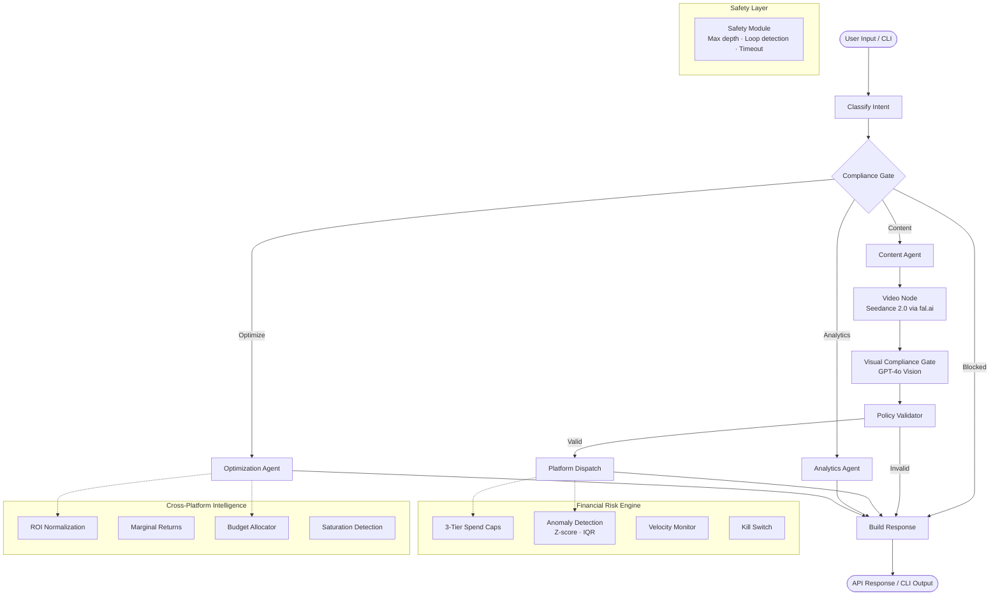

<p align="center">
  <h1 align="center">OrchestraAI</h1>
  <p align="center">
    <strong>AI-native marketing orchestration with financial guardrails.</strong><br>
    One CLI. Nine platforms. Zero runaway spend.
  </p>
  <p align="center">
    
    
    
    
    
    
  </p>
</p>

---

OrchestraAI is an open-source platform that lets you manage campaigns across
**Twitter, YouTube, TikTok, Pinterest, Facebook, Instagram, LinkedIn, Snapchat,
and Google Ads** from a single CLI or API -- powered by a LangGraph multi-agent
orchestrator with 3-phase guardrailed bidding and 3-tier financial risk containment.

## Install in 60 Seconds

```bash
# Clone and install
git clone https://github.com/orchestraai/orchestraai.git
cd orchestraai
pip install -e ".[dev]"

# Start infrastructure (Postgres, Redis, Qdrant, Kafka, Ollama)
docker compose up -d

# Copy the example env and configure
cp .env.example .env
# Set OPENAI_API_KEY, FAL_API_KEY, STRIPE_SECRET_KEY, DATABASE_URL etc.

# Verify everything is running
orchestra status
```

## Quick Start

```bash
# Register and authenticate
orchestra auth register --email you@company.com --name "Your Name" --tenant "Acme Corp"

# Create a campaign across multiple platforms
orchestra campaign create
# → Interactive: name, platforms (twitter,instagram,linkedin), budget

# Let the AI orchestrator do the work
orchestra ask "Write a product launch post for Twitter and LinkedIn, professional tone"

# Check performance across all connected platforms
orchestra analytics --days 7

# List your campaigns
orchestra campaign list
```

<details>
<summary><strong>More CLI examples</strong></summary>

```bash
# Natural-language orchestration
orchestra ask "Optimize my Q1 campaign budget across platforms"
orchestra ask "Generate a carousel post for Instagram about our new feature"
orchestra ask "Show me engagement trends for the last 30 days"

# Campaign lifecycle
orchestra campaign get <campaign-id>
orchestra campaign launch <campaign-id>
orchestra campaign pause <campaign-id>

# Account management
orchestra auth whoami
orchestra auth logout
orchestra config
orchestra version
```

</details>

## Why Not Hootsuite?

| Capability | OrchestraAI | Hootsuite | Buffer | DIY Scripts |
|---|:---:|:---:|:---:|:---:|
| **AI Agent Orchestration** (LangGraph multi-agent graph) | :white_check_mark: | :x: | :x: | :x: |
| **AI Video Generation** (Seedance 2.0 via fal.ai) | :white_check_mark: | :x: | :x: | :x: |
| **Visual Compliance Gate** (GPT-4o Vision IP/copyright scan) | :white_check_mark: | :x: | :x: | :x: |
| **Cross-Platform Intelligence** (ROI normalization, marginal returns) | :white_check_mark: | :x: | :x: | :x: |
| **Guardrailed Bidding** (3-phase autonomy model) | :white_check_mark: | :x: | :x: | :x: |
| **Financial Risk Containment** (3-tier caps, anomaly detection, kill switch) | :white_check_mark: | :x: | :x: | :x: |
| **Self-Hostable** (Docker Compose, your data stays yours) | :white_check_mark: | :x: | :x: | :white_check_mark: |
| **CLI-First** (Typer + Rich, scriptable, pipe-friendly) | :white_check_mark: | :x: | :x: | :white_check_mark: |
| **RAG Memory** (Qdrant vector store, learns from your campaigns) | :white_check_mark: | :x: | :x: | :x: |
| **AI Customer Support** (Chat agent, FAQ, guardrailed responses) | :white_check_mark: | :x: | :x: | :x: |
| **Open Source** (Apache 2.0, extend anything) | :white_check_mark: | :x: | :x: | :white_check_mark: |
| 9 Platform Connectors | :white_check_mark: | :white_check_mark: | Partial | Manual |

## Architecture

The core is a **LangGraph StateGraph** with 10 nodes and conditional routing.
Every request passes through a compliance gate before any action is taken, and
video content is scanned by a Visual Compliance Gate before delivery.



## Financial Risk Containment

This is the feature that SaaS tools don't have. OrchestraAI treats your ad spend
like a financial system, not a suggestion box.

**3-Tier Spend Caps** -- Daily, weekly, and monthly hard limits per campaign and
per tenant. Breaching any tier halts spend immediately.

**Anomaly Detection** -- Z-score and IQR-based statistical detection catches
unusual spend patterns before they drain budgets. Configurable thresholds.

**Velocity Monitoring** -- Tracks spend-per-minute velocity against baselines.
Detects sudden spikes that point to misconfigured bids or bot traffic.

**Kill Switch** -- Instant emergency halt across all platforms. One command stops
everything. Logged, auditable, reversible.

## Guardrailed Bidding

A 3-phase autonomy model that earns trust over time:

| Phase | Behavior | Human Involvement |
|---|---|---|
| **Hard Guardrail** | All bids require explicit approval | Every action reviewed |
| **Semi-Autonomous** | AI recommends, auto-executes within bounds | Review exceptions only |
| **Controlled Autonomous** | Full AI control within strict guardrails | Monitor dashboards |

Each phase has its own spend limits, approval thresholds, and escalation rules.
Promotion between phases requires demonstrated performance and explicit opt-in.

## Platform Support

All 9 connectors make real HTTP calls to production APIs with OAuth 2.0,
retry logic (exponential backoff, 3 attempts), and rate limit handling.

| Platform | OAuth | Publish | Analytics | Audience |
|---|:---:|:---:|:---:|:---:|
| **Twitter** | :white_check_mark: | :white_check_mark: | :white_check_mark: | :white_check_mark: |
| **YouTube** | :white_check_mark: | :white_check_mark: | :white_check_mark: | :white_check_mark: |
| **TikTok** | :white_check_mark: | :white_check_mark: | :white_check_mark: | :white_check_mark: |
| **Pinterest** | :white_check_mark: | :white_check_mark: | :white_check_mark: | :white_check_mark: |
| **Facebook** | :white_check_mark: | :white_check_mark: | :white_check_mark: | :white_check_mark: |
| **Instagram** | :white_check_mark: | :white_check_mark: | :white_check_mark: | :white_check_mark: |
| **LinkedIn** | :white_check_mark: | :white_check_mark: | :white_check_mark: | :white_check_mark: |
| **Snapchat** | :white_check_mark: | :white_check_mark: | :white_check_mark: | :white_check_mark: |
| **Google Ads** | :white_check_mark: | :white_check_mark: | :white_check_mark: | :white_check_mark: |

## CLI Reference

OrchestraAI is **CLI-first**. Everything you can do through the API, you can do
from your terminal.

```
orchestra auth register       Register a new account
orchestra auth login          Authenticate (email/password or API key)
orchestra auth logout         Clear stored credentials
orchestra auth whoami         Show current user info

orchestra campaign list       List all campaigns
orchestra campaign create     Create a new campaign (interactive)
orchestra campaign get <id>   Show campaign details
orchestra campaign launch <id>  Launch a campaign
orchestra campaign pause <id>   Pause a campaign

orchestra ask "<prompt>"      Natural-language instruction to the AI orchestrator
orchestra analytics           Cross-platform analytics overview
orchestra status              Health check all infrastructure services
orchestra config              Show CLI configuration
orchestra version             Show version
```

## Tech Stack

| Layer | Technology |
|---|---|
| API | FastAPI, Uvicorn, Pydantic |
| Agents | LangGraph, LangChain, OpenAI / Anthropic / Ollama |
| Video | Seedance 2.0 (fal.ai), ffmpeg, GPT-4o Vision compliance |
| Vector DB | Qdrant (RAG, campaign memory, data moat) |
| Database | PostgreSQL 16, SQLAlchemy 2.0, Alembic |
| Cache / Events | Redis 7, Apache Kafka |
| CLI | Typer, Rich |
| Security | JWT (python-jose), bcrypt, Fernet encryption |
| Infra | Docker Compose (app + postgres + redis + qdrant + kafka + ollama) |

## Video Pipeline

AI-powered video ad generation with automated IP safety scanning:

| Component | Technology | Details |
|---|---|---|
| **Generation** | ByteDance Seedance 2.0 via fal.ai | Text-to-video and image-to-video, 5s 720p clips at ~$0.26 each |
| **Compliance** | Visual Compliance Gate (GPT-4o Vision) | Extracts keyframes via ffmpeg, scans for celebrity likenesses, copyrighted characters, and trademarked logos |
| **Delivery** | Conditional pass/block | Safe videos render in an HTML5 player; flagged videos show a violation card with details |

Prompt the orchestrator with something like *"Generate a video ad for our summer sale"* and the
pipeline handles generation, compliance scanning, and delivery end-to-end.

## AI Customer Support

Built-in AI-powered customer support with chat, auto-reply, and FAQ management:

| Feature | Description |
|---|---|
| **AI Support Agent** | Natural-language chat powered by OpenAI/Anthropic/Ollama with RAG context retrieval and automatic fallback |
| **Chat Sessions** | Persistent multi-turn conversations with session history, resolve/close lifecycle |
| **FAQ System** | Categorized FAQ with search, admin CRUD, global and tenant-specific entries |
| **Guardrailed Responses** | System prompt prevents disclosure of internal architecture, API keys, or pricing algorithms. Post-processing sanitizer strips sensitive patterns |
| **Tenant Isolation** | All chat sessions and FAQ entries scoped by tenant with RBAC enforcement |

Access via the **Support** tab in the web dashboard or through the API endpoints
(`/api/v1/support/*` and `/api/v1/faq`).

## Promotional Website

A standalone Next.js marketing site showcasing all OrchestraAI features:

```bash
cd website && npm run dev    # → http://localhost:3000
```

| Page | Content |
|---|---|
| **Home** | Hero, platform logos, how-it-works, feature highlights, animated stats, social proof, CTA |
| **Features** | 8 detailed feature sections with alternating layouts |
| **Pricing** | Starter/Agency cards, self-host option, ROI calculator |
| **Security** | Authentication, RBAC, GDPR, audit, IP protection, multi-tenant, SOC 2 |
| **FAQ** | Searchable accordion with 7 categories |
| **Contact** | Contact form, email, live chat link, response time info |

Built with Next.js 16, Tailwind CSS v4, Framer Motion, and Geist fonts -- matching
the dashboard's dark theme and indigo accent branding.

## Documentation

- [Architecture Guide](docs/architecture.md)
- [Guardrailed Bidding](docs/guardrailed-bidding.md)
- [Security & Compliance](docs/security-compliance.md)
- [Data Moat Strategy](docs/data-moat.md)
- [Cost Analysis](docs/cost-analysis.md)
- [Launch Strategy](docs/launch-strategy.md)
- [User Procedures](docs/user-procedures.md)
- [Marketing Video](docs/marketing_video.md)

## Self-Hosting

```bash
# Full stack with one command
docker compose up -d

# Services started:
#   app       → localhost:8000  (API + Dashboard)
#   postgres  → localhost:5432  (PostgreSQL 16)
#   redis     → localhost:6379  (Cache + Events)
#   qdrant    → localhost:6333  (Vector DB)
#   kafka     → localhost:9092  (Event Bus)
#   ollama    → localhost:11434 (Local LLM)
```

Your data never leaves your infrastructure. No telemetry. No phone-home.

## Contributing

See [CONTRIBUTING.md](CONTRIBUTING.md) for development setup, code standards,
and PR guidelines.

```bash
# Quick dev setup
git clone https://github.com/orchestraai/orchestraai.git
cd orchestraai
pip install -e ".[dev]"
docker compose up -d
pytest
```

## Enterprise Cloud Edition

Love OrchestraAI but your team has outgrown the CLI? The **Enterprise Cloud Edition**
is a fully managed SaaS layer built on top of this open-source core -- designed for
agencies and corporate marketing teams that need collaboration, compliance, and
zero-ops infrastructure.

| | Community (This Repo) | Enterprise Cloud |
|---|:---:|:---:|
| **9 Platform Connectors** | :white_check_mark: | :white_check_mark: |
| **AI Agent Orchestration** | :white_check_mark: | :white_check_mark: |
| **Guardrailed Bidding & Risk Containment** | :white_check_mark: | :white_check_mark: |
| **Cross-Platform Intelligence** | :white_check_mark: | :white_check_mark: |
| **Interface** | CLI + API | Web Dashboard + CLI + API |
| **Hosting** | Self-hosted (Docker) | Fully managed cloud |
| **SSO / SAML** | -- | :white_check_mark: |
| **Multi-player RBAC** | API-level | Visual team management |
| **Advanced Analytics Dashboards** | -- | :white_check_mark: |
| **White-Label for Agencies** | -- | :white_check_mark: |
| **Managed LLM Key Proxying** | -- | :white_check_mark: |
| **SOC 2 Compliance & SLA** | -- | :white_check_mark: |
| **AI Customer Support Chat & FAQ** | :white_check_mark: | :white_check_mark: |
| **Priority Support** | Community | Dedicated |
| **License** | Apache 2.0 | Commercial |

**Who is it for?**

- **Agencies** managing 10+ client accounts who need white-labeled dashboards and team permissions.
- **Marketing directors** who need SOC 2 compliance reports and guaranteed uptime SLAs.
- **Teams** that want the power of OrchestraAI without managing Docker, Postgres, and API keys.

The open-source core is the full engine -- the Enterprise Cloud adds the cockpit.

> Interested in early access? Reach out at **enterprise@orchestraai.dev**

## License

[Apache License 2.0](LICENSE) -- use it commercially, modify it, distribute it.
Just include the license and state your changes.

---

<p align="center">
  Built for marketers who care about where their money goes.<br>
  <strong>OrchestraAI</strong> -- orchestrate everything, overspend nothing.
</p>
