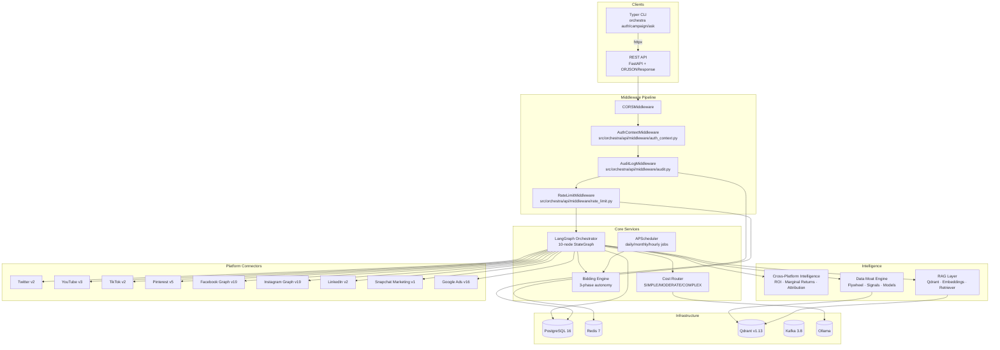
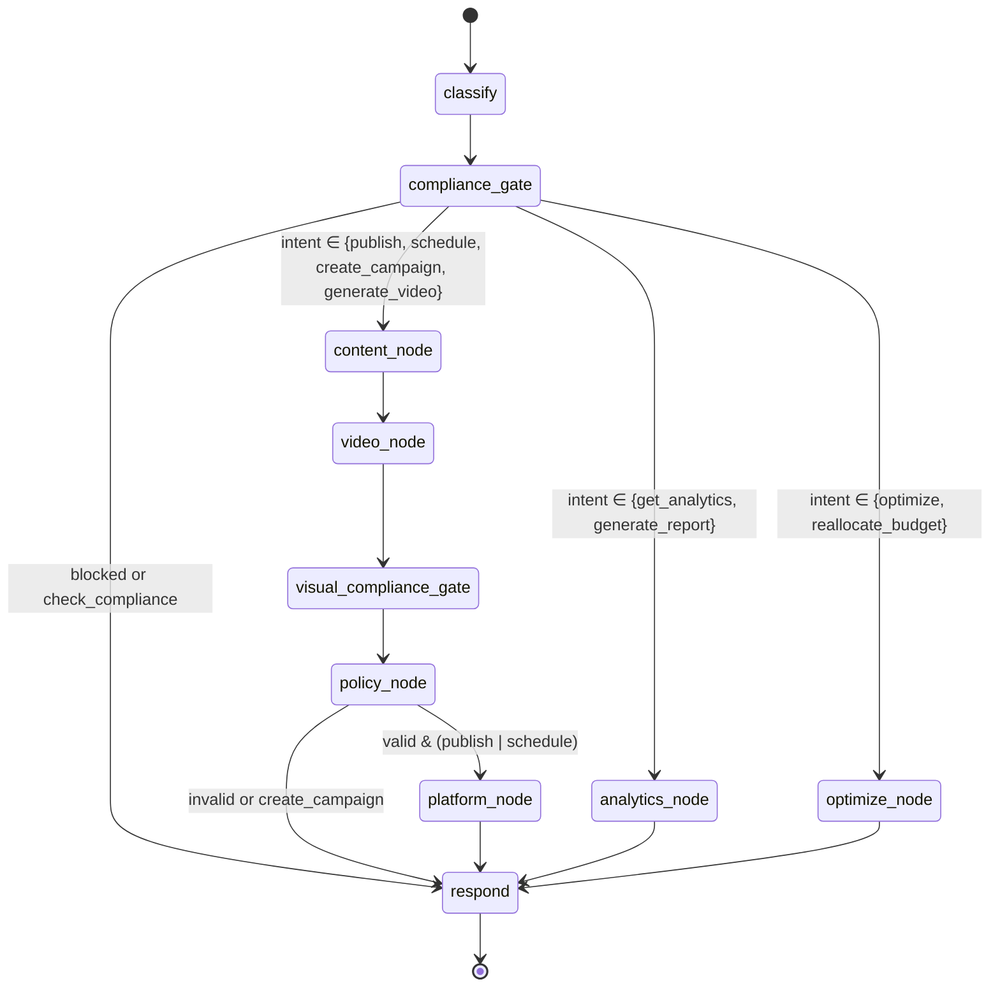

# OrchestraAI Architecture

## Executive Overview

OrchestraAI is a multi-tenant, AI-native marketing orchestration platform built on Python 3.12+, FastAPI, and LangGraph. It unifies campaign creation, cross-platform publishing, analytics aggregation, and budget optimization behind a single LangGraph agent graph. Nine platform connectors (Twitter, YouTube, TikTok, Pinterest, Facebook, Instagram, LinkedIn, Snapchat, Google Ads) make real HTTP calls to production APIs with OAuth2 authentication, retry logic, and rate-limit detection. Financial risk controls enforce 3-tier spend caps, anomaly detection, and a kill switch. A Qdrant-backed RAG layer and data moat engine drive a compounding intelligence flywheel.

The system runs as a Docker Compose stack of six services and exposes both a FastAPI REST API (`src/orchestra/main.py`) and a Typer+Rich CLI (`src/orchestra/cli/app.py`).

---

## System Architecture



---

## LangGraph Agent Execution Graph

The orchestrator (`src/orchestra/agents/orchestrator.py`) is a compiled `langgraph.graph.StateGraph` with 10 nodes and conditional routing:



### Node Responsibilities

| Node | Function | Module |
|------|----------|--------|
| `classify` | LLM-based intent classification (OpenAI → Anthropic → Ollama) with keyword fallback and in-memory LRU cache (256 entries) | `orchestrator.py:classify_intent` |
| `compliance_gate` | Pre-action compliance check: prohibited content, targeting rules, budget validation | `compliance.py:run_compliance_check` |
| `content_node` | LLM content generation via OpenAI/Anthropic/Ollama fallback chain | `content.py:generate_content` |
| `video_node` | AI video generation via Seedance 2.0 (fal.ai); triggers on `generate_video` intent, supports text-to-video and image-to-video | `core/video_service.py:generate_video` |
| `visual_compliance_gate` | Extracts keyframes via ffmpeg, scans with GPT-4o Vision for celebrity likenesses, copyrighted characters, and trademarked logos | `core/visual_compliance.py:check_visual_compliance` |
| `policy_node` | Platform-specific policy validation: character limits, hashtag rules, media constraints | `policy.py:validate_content_policy` |
| `platform_node` | Dispatch publish/schedule action to the appropriate platform connector | `platform_agent.py:execute_platform_action` |
| `analytics_node` | Cross-platform metrics aggregation with real connector calls and benchmark comparison | `analytics_agent.py:run_analytics` |
| `optimize_node` | Campaign optimization via Thompson Sampling, UCB, and Bayesian budget allocation | `optimizer.py:run_optimization` |
| `respond` | Build final response from agent results, clean up execution trace | `orchestrator.py:respond` |

Safety module (`agents/safety.py`) enforces: max depth (10), max calls per trace (50), same-agent loop detection (>3 consecutive), and timeout (120s).

---

## Platform Connector Layer

All 9 connectors inherit from a shared base (`src/orchestra/platforms/base.py`) and implement:

| Connector | API | Publish | Analytics | Audience |
|-----------|-----|---------|-----------|----------|
| Twitter | Twitter API v2 | Tweet creation | Public/non-public metrics | Follower counts |
| YouTube | YouTube Data API v3 | Resumable video upload | View/like/comment counts | Subscriber counts |
| TikTok | TikTok API v2 | Video publish (pull-from-URL) | Like/comment/share/view | Follower/following |
| Pinterest | Pinterest API v5 | Pin creation with board | 30-day impressions/clicks/saves | Follower/pin counts |
| Facebook | Meta Graph API v19.0 | Page posts + scheduling | Post insights | Page follower data |
| Instagram | Instagram Graph API v19.0 | Container-based upload | Impressions/reach/saves | Demographics |
| LinkedIn | LinkedIn API v2 | UGC posts with articles | Social actions | OIDC profile |
| Snapchat | Snapchat Marketing API v1 | Snap Ad creative creation | Impressions/swipes/video views | Org metadata |
| Google Ads | Google Ads API v16 | Responsive Search Ad creation | GAQL campaign queries | Customer info |

Shared traits: `tenacity` retry (3 attempts, 2-30s exponential backoff), 429 rate-limit detection with Retry-After, content validation against platform limits, `structlog` structured logging, `httpx.AsyncClient` for all HTTP calls, Fernet-encrypted OAuth tokens at rest.

---

## Database Schema

Ten SQLAlchemy models defined in `src/orchestra/db/models.py`, all with PostgreSQL UUID primary keys:

| Model | Table | Key Fields | Relationships |
|-------|-------|-----------|---------------|
| `Tenant` | `tenants` | name, slug, bidding_phase, daily/monthly_spend_cap, settings | → users, campaigns, platform_connections |
| `User` | `users` | email, hashed_password, full_name, role (OWNER/ADMIN/MEMBER/VIEWER) | → tenant |
| `PlatformConnection` | `platform_connections` | platform, access_token_encrypted, refresh_token_encrypted, token_expires_at | → tenant |
| `Campaign` | `campaigns` | name, status (DRAFT→ACTIVE→PAUSED→COMPLETED), platforms, budget, spent | → tenant, posts, experiments |
| `CampaignPost` | `campaign_posts` | platform, content, hashtags, media_urls, scheduled_at, platform_post_id | → campaign |
| `AuditLog` | `audit_logs` | action, resource_type, resource_id, details, ip_address, user_agent | indexed by tenant+action |
| `Experiment` | `experiments` | name, hypothesis, variants, status, winner_variant, confidence_level | → campaign |
| `KillSwitchEventLog` | `kill_switch_events` | tenant_id, action, triggered_by, reason, affected_platforms/campaigns | standalone |
| `SpendRecord` | `spend_records` | campaign_id, platform, amount, currency, action, was_anomalous | → tenant, campaign |
| `APIKey` | `api_keys` | name, key_hash (SHA-256), role, is_active, expires_at, last_used_at | → tenant, user |

Session management (`src/orchestra/db/session.py`): Async engine with `pool_size=20`, `max_overflow=10`, `pool_pre_ping=True`. Alembic migrations run automatically on startup when PostgreSQL is available.

---

## Security Architecture

### Middleware Pipeline

Execution order in `src/orchestra/main.py` (last added = first executed):

```
Request → CORS → AuthContextMiddleware → AuditLogMiddleware → RateLimitMiddleware → Route Handler
```

1. **AuthContextMiddleware** (`api/middleware/auth_context.py`): Extracts Bearer token or X-API-Key from headers, decodes via `jose.jwt`, sets `request.state.user` as a `TokenPayload(sub, tenant_id, role, exp)`. Never rejects -- public endpoints pass through.

2. **AuditLogMiddleware** (`api/middleware/audit.py`): Reads `request.state.user` to log `user_id`, `tenant_id`, action, resource, IP address, and user agent to the `audit_logs` table via fire-and-forget async write.

3. **RateLimitMiddleware** (`api/middleware/rate_limit.py`): Tenant-based rate limiting (configurable `requests_per_minute`) with Redis-backed counters. Falls back to IP-based limiting for unauthenticated requests.

### Dual Auth Mechanism

- **JWT Bearer tokens**: Created by `create_access_token()` with HS256 signing, bcrypt-hashed passwords, configurable expiry.
- **API keys**: SHA-256 hashed, stored in `api_keys` table, looked up via `_resolve_api_key()`. Falls back to treating the key as a JWT for backward compatibility.
- **RBAC**: `require_role(*allowed_roles)` FastAPI dependency enforces role-based access (OWNER, ADMIN, MEMBER, VIEWER).

### Encryption at Rest

- OAuth access and refresh tokens encrypted via `cryptography.fernet.Fernet` (AES-128-CBC + HMAC-SHA256) in `src/orchestra/security/encryption.py`.
- Encryption key sourced from `FERNET_KEY` environment variable.

---

## Cost-Aware Model Routing

### Text Tiers (`src/orchestra/core/cost_router.py`)

The `route_model(complexity, prefer_local)` function selects models by `TaskComplexity`:

| Complexity | Primary | Fallback | Use Case |
|-----------|---------|----------|----------|
| `SIMPLE` | OpenAI `gpt-4o-mini` | Ollama (local) | Intent classification, simple Q&A |
| `MODERATE` | OpenAI `gpt-4o-mini` | Anthropic → Ollama | Content generation, analytics insights |
| `COMPLEX` | Anthropic `claude-3.5-sonnet` | OpenAI → Ollama | Strategy, multi-step reasoning |

### Video Generation Pipeline

Video generation uses ByteDance **Seedance 2.0** via the fal.ai API (`src/orchestra/core/video_service.py`):

| Mode | Model ID | Cost | Output |
|------|----------|------|--------|
| Text-to-video | `fal-ai/bytedance/seedance/v1.5/pro/text-to-video` | ~$0.26 per 5s 720p clip | MP4 video from a text prompt |
| Image-to-video | `fal-ai/bytedance/seedance/v1/pro/image-to-video` | ~$0.26 per 5s 720p clip | MP4 video from a reference image + prompt |

Requires `FAL_API_KEY` in the environment. When the key is absent, the video node is a no-op passthrough.

### Visual Compliance Gate

Every generated video passes through an automated IP/copyright scanner (`src/orchestra/core/visual_compliance.py`) before reaching the user:

1. **Download** the generated MP4 to a temp directory
2. **Extract keyframes** -- ffmpeg extracts 4 evenly-spaced frames
3. **Scan with GPT-4o Vision** -- frames are base64-encoded and sent with a strict system prompt that checks for celebrity likenesses, copyrighted characters/IP, and trademarked logos
4. **Pass/Block** -- if zero violations are found the video URL passes through; otherwise the video is blocked and violations are returned to the frontend

Cost: ~$0.01--0.03 per scan (one GPT-4o Vision call with 4 image inputs).

---

## Failure Recovery

### Retry with Tenacity

All platform connectors use `@retry(stop=stop_after_attempt(3), wait=wait_exponential(min=2, max=30))` from the `tenacity` library. Rate-limited responses (HTTP 429) are detected and the Retry-After header is respected.

### Graceful Degradation

- **LLM fallback chain**: OpenAI → Anthropic → Ollama (local) → keyword-based fallback. Every LLM call site implements this cascade.
- **Embedding fallback**: OpenAI `text-embedding-3-small` → Ollama `nomic-embed-text` → deterministic hash-based embedding for testing environments.
- **Database unavailability**: API endpoints return 503 Service Unavailable; RAG operations fall back to in-memory caching.

### Kill Switch

`BiddingEngine.activate_kill_switch()` in `src/orchestra/bidding/engine.py` immediately halts all spend operations by raising `BudgetExceededError` for any `evaluate_action()` call. Deactivation requires explicit manual action. Events are persisted to `KillSwitchEventLog` and exposed via the `/api/v1/kill-switch` route.

---

## Infrastructure

### Docker Compose Stack (`docker-compose.yml`)

| Service | Image | Ports | Purpose |
|---------|-------|-------|---------|
| `app` | Custom Dockerfile (multi-stage) | 8000 | FastAPI application |
| `postgres` | `postgres:16-alpine` | 5432 | Primary data store |
| `redis` | `redis:7-alpine` | 6379 | Caching, rate limiting, session store |
| `qdrant` | `qdrant/qdrant:v1.13.2` | 6333, 6334 | Vector database for RAG + data moat |
| `kafka` | `apache/kafka:3.8.1` | 9092 | Event streaming (campaign events, signals) |
| `ollama` | `ollama/ollama:latest` | 11434 | Local LLM inference |

Health checks: PostgreSQL (`pg_isready`), Redis (`redis-cli ping`), Kafka (broker API versions). All services connected via `orchestra-net` bridge network. Persistent volumes for all stateful services.

### Scheduler (`src/orchestra/core/scheduler.py`)

Three registered APScheduler background jobs:

| Job | Trigger | Purpose |
|-----|---------|---------|
| `reset_daily_spend` | CronTrigger: midnight UTC | Reset daily spend caps for all tenants |
| `reset_monthly_spend` | CronTrigger: 1st of month, 00:05 UTC | Reset monthly spend counters |
| `update_velocity_baselines` | IntervalTrigger: every 1 hour | Update spend velocity baselines for anomaly detection |
