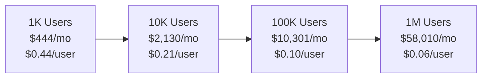

# OrchestraAI Cost Analysis

## Platform API Costs

### Per-Platform Pricing (as of 2026)

| Platform | API Tier | Monthly Cost | Rate Limits | Notes |
|----------|----------|-------------|-------------|-------|
| **Twitter** | Basic | $100/month | 10,000 tweets read, 1,500 tweets/month write | Required for tweet creation and analytics. Free tier only reads |
| **YouTube** | Free | $0 | 10,000 units/day (~100 video uploads) | YouTube Data API v3 quota is generous for most use cases |
| **TikTok** | Free | $0 | Standard rate limits | TikTok API v2 is free for approved developers |
| **Pinterest** | Free | $0 | 1,000 requests/min | Pinterest API v5 free for approved apps |
| **Facebook** | Free | $0 | 200 calls/user/hour | Meta Graph API v19.0 free with developer account |
| **Instagram** | Free | $0 | 200 calls/user/hour | Instagram Graph API shares Meta's free tier |
| **LinkedIn** | Free | $0 | 100 requests/day (standard) | LinkedIn API v2 free for approved applications |
| **Snapchat** | Free | $0 | Standard rate limits | Snapchat Marketing API free for ad account holders |
| **Google Ads** | Free | $0 | 15,000 operations/day | Free with approved developer token. Production requires Google approval |

### Total Platform API Cost

| Scenario | Monthly Cost |
|----------|-------------|
| **Minimum** (YouTube + free platforms only) | $0/month |
| **Standard** (all 9 platforms including Twitter Basic) | $100/month |
| **High Volume** (Twitter Pro for higher limits) | $5,000/month |

---

## Infrastructure Costs at Scale

### Docker Compose Stack Sizing

Costs estimated for cloud hosting (AWS/GCP equivalent). Self-hosted costs are hardware + electricity only.

#### 1,000 Users (Startup)

| Service | Spec | Monthly Cost (Cloud) |
|---------|------|---------------------|
| **FastAPI App** | 2 vCPU, 4 GB RAM, 1 instance | $40 |
| **PostgreSQL** | 2 vCPU, 4 GB RAM, 50 GB SSD | $80 |
| **Redis** | 1 vCPU, 1 GB RAM (256 MB maxmemory) | $15 |
| **Qdrant** | 2 vCPU, 4 GB RAM, 20 GB SSD | $50 |
| **Kafka** | 2 vCPU, 4 GB RAM, 50 GB SSD | $60 |
| **Ollama** | 4 vCPU, 8 GB RAM (CPU-only) | $80 |
| **Total** | | **$325/month** |

#### 10,000 Users (Growth)

| Service | Spec | Monthly Cost (Cloud) |
|---------|------|---------------------|
| **FastAPI App** | 4 vCPU, 8 GB RAM, 2 instances + LB | $160 |
| **PostgreSQL** | 4 vCPU, 16 GB RAM, 200 GB SSD + 1 read replica | $400 |
| **Redis** | 2 vCPU, 4 GB RAM, Redis Cluster (3 nodes) | $180 |
| **Qdrant** | 4 vCPU, 16 GB RAM, 100 GB SSD, distributed mode | $300 |
| **Kafka** | 3-node cluster, 4 vCPU, 8 GB each, 200 GB SSD | $450 |
| **Ollama** | 1 GPU instance (T4), 16 GB VRAM | $350 |
| **Total** | | **$1,840/month** |

#### 100,000 Users (Scale)

| Service | Spec | Monthly Cost (Cloud) |
|---------|------|---------------------|
| **FastAPI App** | 8 vCPU, 16 GB RAM, 5 instances + ALB | $800 |
| **PostgreSQL** | 8 vCPU, 32 GB RAM, 1 TB SSD + 2 read replicas + PgBouncer | $1,500 |
| **Redis** | Redis Cluster (6 nodes), 4 GB each | $500 |
| **Qdrant** | 3-node cluster, 8 vCPU, 32 GB RAM each, 500 GB SSD | $1,200 |
| **Kafka** | 5-node cluster, 8 vCPU, 16 GB each, 1 TB SSD | $1,500 |
| **Ollama** | 3 GPU instances (A10G), 24 GB VRAM each | $3,000 |
| **Total** | | **$8,500/month** |

#### 1,000,000 Users (Enterprise)

| Service | Spec | Monthly Cost (Cloud) |
|---------|------|---------------------|
| **FastAPI App** | Auto-scaling group, 20+ instances, Kubernetes | $5,000 |
| **PostgreSQL** | Managed (RDS/Cloud SQL), multi-AZ, 5 TB SSD | $8,000 |
| **Redis** | Managed ElastiCache/Memorystore, 12-node cluster | $3,000 |
| **Qdrant** | Managed Qdrant Cloud, dedicated cluster | $5,000 |
| **Kafka** | Managed (MSK/Confluent), 10+ brokers | $6,000 |
| **Ollama** / LLM | Dedicated GPU fleet or API-only (see LLM costs below) | $10,000 |
| **Total** | | **$37,000/month** |

---

## LLM Token Estimates

### Per-Campaign Cost Model

A typical campaign execution through the orchestrator involves:

| Step | Tokens (Input) | Tokens (Output) | Provider |
|------|---------------|-----------------|----------|
| Intent classification | ~200 | ~10 | SIMPLE tier |
| Compliance check | ~300 | ~50 | Rule-based (no LLM) |
| Content generation (3 variants) | ~500 | ~900 | MODERATE tier |
| Policy validation | ~200 | ~30 | Rule-based (no LLM) |
| Analytics insights | ~400 | ~200 | SIMPLE tier |
| **Total per campaign** | **~1,600** | **~1,190** | |

### Provider Pricing Comparison

| Provider | Model | Input $/1M tokens | Output $/1M tokens | Cost per Campaign |
|----------|-------|-------------------|--------------------|--------------------|
| **OpenAI** | gpt-4o-mini | $0.15 | $0.60 | $0.0010 |
| **OpenAI** | gpt-4o | $2.50 | $10.00 | $0.0159 |
| **Anthropic** | claude-3.5-sonnet | $3.00 | $15.00 | $0.0227 |
| **Anthropic** | claude-3.5-haiku | $0.80 | $4.00 | $0.0060 |
| **Ollama** | llama3.2 (local) | $0.00 | $0.00 | $0.0000 |
| **Ollama** | mistral (local) | $0.00 | $0.00 | $0.0000 |

### Monthly LLM Costs by Volume

Using the cost-aware router (`src/orchestra/core/cost_router.py`) which routes SIMPLE tasks to `gpt-4o-mini` and COMPLEX tasks to `claude-3.5-sonnet`:

| Campaigns/Month | Mostly gpt-4o-mini | Mixed (router) | Mostly claude-3.5-sonnet | Ollama Only |
|----------------|-------------------|----------------|--------------------------|-------------|
| 100 | $0.10 | $0.50 | $2.27 | $0.00 |
| 1,000 | $1.00 | $5.00 | $22.70 | $0.00 |
| 10,000 | $10.00 | $50.00 | $227.00 | $0.00 |
| 100,000 | $100.00 | $500.00 | $2,270.00 | $0.00 |

### Embedding Costs

| Provider | Model | $/1M tokens | Tokens/Campaign | Cost/Campaign |
|----------|-------|-------------|-----------------|---------------|
| OpenAI | text-embedding-3-small | $0.02 | ~500 | $0.00001 |
| Ollama | nomic-embed-text | $0.00 | ~500 | $0.00000 |

Embedding costs are negligible at any scale. At 100K campaigns/month with OpenAI embeddings: **$1.00/month**.

---

## Video Generation Costs

Video generation uses ByteDance **Seedance 2.0** via fal.ai (`src/orchestra/core/video_service.py`).

### Seedance 2.0 Pricing

| Mode | Resolution | Duration | Cost per Clip |
|------|-----------|----------|---------------|
| Text-to-video | 720p | 5 seconds | ~$0.26 |
| Image-to-video | 720p | 5 seconds | ~$0.26 |

### Visual Compliance Gate Cost

Every generated video is scanned by the Visual Compliance Gate (`src/orchestra/core/visual_compliance.py`) which extracts 4 keyframes and sends them to GPT-4o Vision:

| Component | Cost per Scan |
|-----------|---------------|
| GPT-4o Vision (4 keyframes) | ~$0.01--0.03 |

### Video Cost Projections

| Monthly Videos | Generation (Seedance) | Compliance Scans | Total |
|---------------|----------------------|-----------------|-------|
| 50 | $13.00 | $1.00 | $14.00 |
| 500 | $130.00 | $10.00 | $140.00 |
| 5,000 | $1,300.00 | $100.00 | $1,400.00 |
| 50,000 | $13,000.00 | $1,000.00 | $14,000.00 |

fal.ai charges are usage-based with no monthly minimum. Compliance scanning adds roughly 5--8% overhead per video.

---

## Cost Optimization Strategies

### 1. Local Ollama for Simple Tasks

The cost router (`route_model()` in `src/orchestra/core/cost_router.py`) supports `prefer_local=True` to force all requests to Ollama:

| Task Type | OpenAI Cost | Ollama Cost | Savings |
|-----------|------------|-------------|---------|
| Intent classification | $0.15/1M tokens | $0.00 | 100% |
| Simple Q&A | $0.15/1M tokens | $0.00 | 100% |
| Content generation | $0.15-$3.00/1M tokens | $0.00 | 100% |

Trade-off: Ollama running locally on a $80/month VM with CPU inference handles ~10 requests/minute. GPU instance ($350/month) handles ~100 requests/minute.

**Break-even**: If cloud LLM costs exceed $350/month (~350,000 campaigns/month on gpt-4o-mini), a dedicated GPU instance is more economical.

### 2. Intent Classification Caching

The orchestrator maintains a 256-entry LRU cache (`_intent_cache` in `src/orchestra/agents/orchestrator.py`) for intent classification results. Identical inputs skip the LLM call entirely.

Estimated cache hit rate: 30-50% for typical usage patterns (many users ask similar questions). This directly reduces SIMPLE-tier LLM costs by 30-50%.

### 3. Embedding Batching

The `embed_texts()` function in `src/orchestra/rag/embeddings.py` accepts batch input. Batching 10 texts in a single API call vs. 10 individual calls reduces:
- HTTP overhead by ~90%
- Latency by ~80%
- No cost difference (OpenAI charges per token, not per request)

### 4. Redis Caching for Analytics

Platform analytics responses can be cached in Redis (LRU policy, 256 MB maxmemory as configured in `docker-compose.yml`). Repeated analytics queries for the same campaign within the cache window avoid redundant platform API calls.

### 5. Seedance Video Economics

Seedance 2.0 via fal.ai provides a single high-quality tier at ~$0.26 per 5-second clip, eliminating multi-tier routing complexity. Cost control levers:

- **Prompt gating**: The LangGraph orchestrator only triggers video generation for `generate_video` intents, preventing accidental generation on text-only requests.
- **Compliance overhead is minimal**: The Visual Compliance Gate adds ~$0.02 per video (one GPT-4o Vision call), a 5--8% overhead that prevents costly IP takedown requests downstream.
- **Duration control**: Default 5-second clips keep per-video cost predictable; longer durations can be enabled per tenant.

---

## Total Cost of Ownership

### Startup (1,000 Users, 1,000 Campaigns/Month)

| Category | Monthly Cost |
|----------|-------------|
| Infrastructure (Docker Compose) | $325 |
| Platform APIs (Twitter Basic) | $100 |
| LLM (mostly gpt-4o-mini) | $5 |
| Embeddings (OpenAI) | $0.02 |
| Video (50 clips, Seedance + compliance) | $14.00 |
| **Total** | **$444.02/month** |

**Per-user cost: $0.44/month**

### Growth (10,000 Users, 10,000 Campaigns/Month)

| Category | Monthly Cost |
|----------|-------------|
| Infrastructure | $1,840 |
| Platform APIs | $100 |
| LLM (cost-aware routing) | $50 |
| Embeddings | $0.20 |
| Video (500 clips, Seedance + compliance) | $140 |
| **Total** | **$2,130.20/month** |

**Per-user cost: $0.21/month**

### Scale (100,000 Users, 100,000 Campaigns/Month)

| Category | Monthly Cost |
|----------|-------------|
| Infrastructure | $8,500 |
| Platform APIs | $100 |
| LLM (routing + Ollama offload) | $300 |
| Embeddings | $1 |
| Video (5,000 clips, Seedance + compliance) | $1,400 |
| **Total** | **$10,301/month** |

**Per-user cost: $0.10/month**

### Enterprise (1,000,000 Users, 1,000,000 Campaigns/Month)

| Category | Monthly Cost |
|----------|-------------|
| Infrastructure | $37,000 |
| Platform APIs | $5,000 (Twitter Pro for volume) |
| LLM (dedicated GPU fleet + API mix) | $2,000 |
| Embeddings | $10 |
| Video (50,000 clips, Seedance + compliance) | $14,000 |
| **Total** | **$58,010/month** |

**Per-user cost: $0.06/month**

---

## Cost Scaling Summary

Key insight: **per-user cost decreases by 86%** from 1K to 1M users due to:

1. **Infrastructure amortization**: Fixed costs (PostgreSQL, Redis, Kafka) spread across more users
2. **LLM efficiency**: Intent caching, Ollama offload, and batching reduce per-campaign LLM costs
3. **Embedding negligibility**: At $0.02/1M tokens, embedding costs never become material
4. **Video scaling**: Seedance via fal.ai is purely usage-based with no fixed overhead; the Visual Compliance Gate adds only 5--8% per-video cost
5. **Platform APIs**: Most APIs are free; only Twitter has meaningful per-user cost implications
