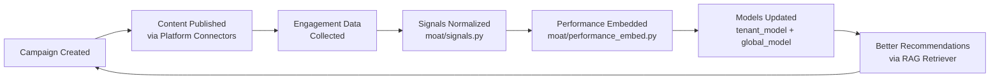

# The Defensible Data Moat

## The Data Flywheel

OrchestraAI's competitive advantage compounds with every campaign executed. The `FlywheelPipeline` (`src/orchestra/moat/flywheel.py`) orchestrates a closed-loop system where output quality improves with usage volume:



### Flywheel Stages

The `FlywheelPipeline` class implements three event handlers that form the loop:

| Stage | Method | What Happens |
|-------|--------|-------------|
| **Creation** | `on_campaign_created()` | Campaign text is embedded via `rag/indexer.py:index_campaign()` and stored in Qdrant for future semantic retrieval |
| **Engagement** | `on_engagement_received()` | Raw platform metrics are normalized via `signals.py:normalize_engagement()`, campaign index is updated with performance data, and content is re-embedded with performance weighting via `performance_embed.py:index_performance()` |
| **Optimization** | `on_optimization_applied()` | Optimization decisions are indexed via `rag/indexer.py:index_decision()` for future decision retrieval and outcome tracking |

### Maturity Model

The flywheel tracks iteration count per tenant and classifies maturity:

| Stage | Iterations | Behavior |
|-------|-----------|----------|
| `cold_start` | 0 | Uses global model benchmarks for recommendations |
| `warming` | 1-9 | Beginning to build tenant-specific patterns |
| `learning` | 10-49 | Sufficient data for basic performance prediction |
| `maturing` | 50-199 | Reliable cross-platform optimization signals |
| `optimized` | 200+ | High-confidence predictions, diminishing returns on new data |

---

## Signal Layer

### Cross-Platform Engagement Normalization (`src/orchestra/moat/signals.py`)

A "like" on Twitter is not equivalent to a "like" on LinkedIn. The signal layer normalizes raw engagement metrics into a unified scoring system using platform-specific weights:

| Signal | Twitter | YouTube | Instagram | Facebook | LinkedIn | TikTok | Pinterest |
|--------|---------|---------|-----------|----------|----------|--------|-----------|
| Impression | 0.01 | — | 0.01 | 0.01 | 0.02 | — | 0.01 |
| View | — | 0.05 | — | — | — | 0.02 | — |
| Like | 0.50 | 0.30 | 0.30 | 0.30 | 0.50 | 0.20 | 0.30 |
| Comment | 2.00 | 3.00 | 2.50 | 2.00 | 3.00 | 2.00 | — |
| Share | 3.00 | 2.00 | 3.00 | 3.50 | 4.00 | 3.00 | 1.50 |
| Click | 1.50 | 1.00 | 2.00 | 1.50 | 2.00 | 1.50 | 2.50 |
| Save | 1.00 | 1.50 | 2.50 | 1.00 | 1.50 | 2.00 | 3.00 |

The `normalize_engagement()` function applies these weights to raw metrics and produces an `EngagementScore` on a 0-100 logarithmic scale (using `log1p` to handle viral outliers gracefully).

### Attention Decay Curves

Each platform has a distinct engagement lifetime modeled by `AttentionDecayCurve`:

| Platform | Half-Life | Peak Hour | Decay Rate | 24h Engagement Captured |
|----------|-----------|-----------|------------|------------------------|
| Twitter | 4 hours | 0 (immediate) | 0.25 | 95% |
| YouTube | 168 hours (7 days) | 24 | 0.01 | 30% |
| Instagram | 12 hours | 2 | 0.08 | 85% |
| Facebook | 8 hours | 1 | 0.12 | 90% |
| LinkedIn | 24 hours | 4 | 0.05 | 75% |
| TikTok | 48 hours | 6 | 0.03 | 55% |

These curves inform optimal measurement windows: Twitter metrics should be evaluated within 4 hours; YouTube campaigns need 7+ days for meaningful data.

### Time-of-Day Intelligence

The `TimeOfDayIntelligence` model tracks optimal posting times per platform per tenant, aggregating `avg_engagement_by_hour` from historical campaign data. This enables the scheduler to time posts for maximum first-hour engagement.

### Content Structure Scoring

The `score_content_structure()` function evaluates content against platform-specific best practices:

- **Length optimization**: Compares text length to platform ideals (Twitter: 100 chars, LinkedIn: 200, YouTube: 300)
- **Question presence**: Questions boost engagement on all platforms
- **CTA detection**: Scans for calls-to-action (click, subscribe, share, etc.)
- **Emoji usage**: Platform-tuned (Instagram/TikTok reward more emoji; LinkedIn penalizes excess)
- **Hashtag count**: Compared to platform ideals (Instagram: 15, Twitter: 2, LinkedIn: 3)

---

## Performance Embedding Engine

### Campaign-to-Vector Encoding (`src/orchestra/moat/performance_embed.py`)

The `PerformanceVector.encode()` method creates embeddings that incorporate content AND outcomes:

```
base_vector = embed_single(content_text)       # 1536-dim via OpenAI/Ollama/hash
performance_score = (ER × 0.4) + (CTR × 0.3) + (ROI_normalized × 0.3)
scale = 1.0 + min(performance_score, 0.5)      # 1.0x to 1.5x
final_vector = base_vector × scale
```

This means high-performing content has larger vector magnitude, causing it to cluster together in vector space. Semantic similarity retrieval then naturally favors content that both looks similar AND performed well.

### Outcome Weighting

Performance metrics are weighted by business impact:

| Metric | Weight | Rationale |
|--------|--------|-----------|
| Engagement Rate | 40% | Primary indicator of content resonance |
| Click-Through Rate | 30% | Direct intent signal |
| ROI (normalized to 0-1 range) | 30% | Business outcome validation |

### Similarity Retrieval

`find_high_performers()` queries Qdrant with a content vector, filtering by `min_engagement_rate >= 0.02`, and returns the top-N most similar high-performing campaigns. This powers the "find content like X that actually worked" capability.

### Tier Clustering

`cluster_campaigns()` groups a tenant's campaigns into performance tiers:

| Tier | Engagement Rate | Purpose |
|------|----------------|---------|
| **High performers** | ≥ 5% | Templates for future content, A/B test control variants |
| **Medium performers** | 2-5% | Candidates for optimization experiments |
| **Low performers** | < 2% | Content patterns to avoid, sunset candidates |

---

## Dual-Layer Model Architecture

### Tenant-Specific Private Model (`src/orchestra/moat/tenant_model.py`)

Each tenant has an isolated `TenantModel` that learns exclusively from their campaigns:

- **Storage**: Qdrant collection `tenant_models`, filtered by `tenant_id`
- **Learning**: `learn_from_campaign()` embeds content + outcome metadata and upserts to tenant-scoped vectors
- **Prediction**: `predict_performance()` finds the top-5 most similar past campaigns and returns a weighted-average engagement rate and ROI prediction, with a confidence score proportional to data volume
- **Best practices**: `get_best_practices()` retrieves the tenant's highest-performing content for a given platform, sorted by engagement rate
- **GDPR**: `export_data()` and `delete_all()` implement right-to-access and right-to-erasure

Privacy guarantee: tenant data never leaves their Qdrant partition. The `tenant_id` filter on every vector query ensures complete isolation.

### Anonymized Global Model (`src/orchestra/moat/global_model.py`)

The global model aggregates anonymized patterns across all tenants for cold-start recommendations and industry benchmarking:

- **Storage**: Qdrant collection `global_patterns`, all entries tagged `tenant_id="global"`
- **Anonymization**: Content is SHA-256 hashed (only first 16 chars of hash retained) -- no reversible mapping to original content
- **Differential privacy**: All metrics receive Laplace noise before storage

#### Laplace Mechanism Implementation

```python
sensitivity = abs(value) * 0.1 + 0.01   # 10% of value + small constant
noise = uniform(-1, 1) * (sensitivity / epsilon)   # epsilon = 1.0
noisy_value = max(value + noise, 0.0)
```

With **ε = 1.0**, individual tenant contributions are protected by a noise level proportional to 10% of the metric value. This prevents an adversary from determining whether a specific tenant's data is present in the global model.

#### Global Model Capabilities

| Method | Input | Output |
|--------|-------|--------|
| `contribute()` | Anonymized content + noisy metrics + platform + category | Upsert to `global_patterns` collection |
| `get_benchmarks()` | Platform, optional category | Avg engagement rate, avg CTR, top content types, top length buckets |
| `cold_start_recommendation()` | Platform, category | Target engagement rate, suggested content type, confidence score |

---

## Network Effects

OrchestraAI exhibits two types of network effects:

### Direct (Per-Tenant)

Each tenant's data moat deepens independently:

```
More campaigns → more engagement data → better embeddings → higher prediction confidence → better content → more campaigns
```

Switching cost increases with every iteration. After 200+ campaigns, the tenant model provides predictions that no competitor can replicate without the same historical data.

### Indirect (Cross-Tenant via Global Model)

More tenants contribute to stronger global benchmarks:

```
More tenants → more anonymized data → better cold-start recommendations → faster time-to-value for new tenants → easier acquisition → more tenants
```

The cold-start problem is progressively eliminated: new tenants benefit from the aggregate intelligence of all existing tenants without accessing any individual's data.

---

## Competitive Sustainability

### Why This Moat Is Defensible

1. **Data gravity**: Campaign performance data is generated exclusively within OrchestraAI. Competitors cannot access it.
2. **Embedding specificity**: Performance-weighted embeddings are a proprietary representation. Generic embeddings from OpenAI or Cohere cannot replicate outcome-aware clustering.
3. **Time advantage**: The flywheel has been running since tenant onboarding. Every day of usage increases the gap.
4. **Privacy-preserving aggregation**: The dual-model architecture (private + anonymized global) is architecturally difficult to retrofit onto existing platforms that commingle tenant data.

### Competitive Landscape

| Competitor | Data Moat | Differentiator |
|-----------|-----------|----------------|
| Hootsuite | Social listening data (no campaign-performance correlation) | OrchestraAI ties content → outcome → embedding |
| HubSpot | CRM + email data (no cross-platform normalization) | OrchestraAI normalizes 9 platforms into unified signals |
| Buffer | Scheduling data (no AI optimization loop) | OrchestraAI's flywheel compounds intelligence |
| Jasper AI | Content generation (no performance feedback) | OrchestraAI closes the loop: generate → measure → learn |

---

## Data Privacy Guarantees

| Guarantee | Implementation | Location |
|-----------|---------------|----------|
| Tenant data isolation | Every Qdrant query filtered by `tenant_id` | `rag/store.py`, `moat/tenant_model.py` |
| No cross-tenant data leakage | Global model uses SHA-256 content hashing + Laplace noise | `moat/global_model.py` |
| Right to access | `TenantModel.export_data()` returns all stored patterns | `moat/tenant_model.py` |
| Right to erasure | `TenantModel.delete_all()` purges all tenant vectors from Qdrant | `moat/tenant_model.py` |
| Campaign indexer cleanup | `CampaignIndexer.delete_tenant_data()` removes campaign and decision vectors | `rag/indexer.py` |
| Differential privacy | Laplace mechanism with ε=1.0 on all global model contributions | `moat/global_model.py:_add_laplace_noise()` |
| Encryption at rest | OAuth tokens encrypted with Fernet (AES-128-CBC + HMAC-SHA256) | `security/encryption.py` |
