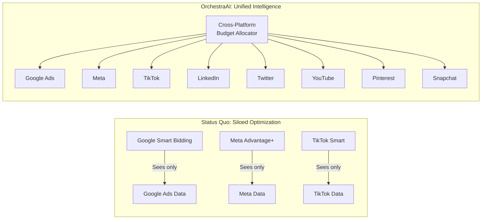
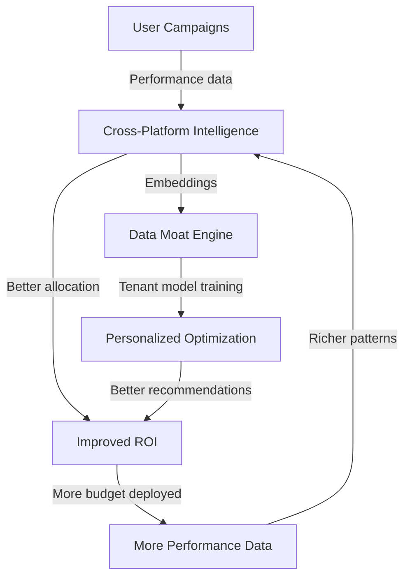

# Competitive Differentiation & Moat Mechanisms

**OrchestraAI** — AI-Native Marketing Orchestration Platform

---

## 1. Competitive Landscape

The marketing technology space is crowded but fragmented. Competitors fall into three categories: social media management platforms, single-platform AI optimizers, and marketing clouds.

### Social Media Management Platforms

| Platform | Strengths | Weaknesses |
|----------|-----------|------------|
| **Hootsuite** | Broad platform coverage, enterprise features, scheduling | No AI-driven bidding, no budget optimization, no cross-platform intelligence. Primarily a publishing/scheduling tool. |
| **Buffer** | Simple UX, SMB-friendly pricing, analytics | No AI content generation, no bidding automation, limited to organic social. |
| **Sprout Social** | Social listening, customer care workflows, reporting | Expensive enterprise pricing, no autonomous bidding, no self-hosting option. |
| **Later** | Visual planning for Instagram, link-in-bio tools | Single-platform focus (Instagram-first), no AI orchestration, no paid ad management. |

### Marketing Clouds

| Platform | Strengths | Weaknesses |
|----------|-----------|------------|
| **HubSpot Marketing Hub** | CRM integration, email marketing, lead scoring | Closed ecosystem, expensive at scale, no cross-platform AI bidding, no self-hosting. |
| **Salesforce Marketing Cloud** | Enterprise scale, journey builder, CDP integration | Extremely expensive, requires dedicated admin, no open-source component. |
| **Adobe Experience Cloud** | Content management, personalization, analytics | Highest cost, longest implementation, vendor lock-in. |

### Single-Platform AI Optimizers

| Tool | Platform | What It Does | Limitation |
|------|----------|-------------|------------|
| **Google Smart Bidding** | Google Ads | Automated bid strategies (tCPA, tROAS, maximize conversions) | Only sees Google data; cannot shift budget to Meta when Google underperforms. |
| **Meta Advantage+** | Facebook/Instagram | Automated ad placements, creative optimization, budget allocation | Only optimizes within Meta's ecosystem; cannot account for LinkedIn or TikTok performance. |
| **TikTok Smart Performance** | TikTok | Automated targeting and creative optimization | Limited to TikTok inventory; no cross-network visibility. |

---

## 2. OrchestraAI vs Competitors

| Feature | OrchestraAI | Hootsuite | Buffer | Sprout Social | HubSpot | Smart Bidding | Advantage+ |
|---------|:-----------:|:---------:|:------:|:-------------:|:-------:|:-------------:|:----------:|
| **AI Content Generation** | LangGraph multi-agent with LLM fallback chain | Basic AI assist | AI assistant (limited) | Limited | AI beta features | None | Creative optimization |
| **Cross-Platform Intelligence** | Unified data layer across 9 platforms | Siloed per-platform | Siloed | Siloed reporting | Limited | Single-platform | Single-platform |
| **Guardrailed Bidding** | 3-phase autonomy with kill switch | None | None | None | None | Automated (no user guardrails) | Automated (no user guardrails) |
| **Financial Risk Containment** | 3-tier spend caps + anomaly detection + velocity monitoring | Basic budget tracking | None | Budget reporting | Budget tracking | Daily budgets only | Campaign budgets only |
| **Platform Connectors** | 9 (Twitter, YouTube, TikTok, Pinterest, Facebook, Instagram, LinkedIn, Snapchat, Google Ads) | 10+ | 8 | 8 | 6 | 1 (Google) | 2 (Meta) |
| **Open Source** | Apache 2.0 | Closed | Closed | Closed | Closed | Closed | Closed |
| **Self-Hostable** | Docker Compose (Postgres + Redis + Qdrant + Kafka + Ollama) | SaaS only | SaaS only | SaaS only | SaaS only | SaaS only | SaaS only |
| **CLI-First Interface** | Typer + Rich (`orchestra ask "..."`) | Web only | Web only | Web only | Web only | Web only | Web only |
| **RBAC** | 4 roles, 26 permissions, JWT + API key | Team roles | Team roles | Custom roles | Custom roles | Google Workspace | Meta Business |
| **Kill Switch** | Global + per-tenant, halts all spend instantly | None | None | None | None | Campaign-level pause | Campaign-level pause |
| **Audit Trail** | Every action logged with user_id, tenant_id, risk_score | Activity log | Activity log | Audit log | Audit log | None | None |
| **Pricing** | Free (self-hosted) | $99-$739/mo | $6-$120/mo | $199-$399/mo | $800-$3,600/mo | Included with ad spend | Included with ad spend |

---

## 3. Why Cross-Platform Intelligence Is the Moat

### The Single-Platform Blindness Problem

Google Smart Bidding optimizes your Google Ads campaigns. Meta Advantage+ optimizes your Facebook/Instagram campaigns. But neither knows the other exists.

This creates a structural problem:



When Google Ads CPM spikes (say, during a holiday auction), Smart Bidding will try to optimize within Google — but it cannot move budget to LinkedIn where CPMs are 40% lower for the same audience. OrchestraAI can.

### Implemented Cross-Platform Intelligence Modules

These modules are implemented in `src/orchestra/intelligence/`:

| Module | What It Does | Key Algorithm |
|--------|-------------|---------------|
| **ROI Normalizer** | Normalizes metrics across platforms with different CPM baselines | Platform-specific CPM normalization coefficients |
| **Marginal Return Curves** | Models diminishing returns per platform | Logarithmic spend-to-return curves |
| **Budget Allocator** | Reallocates budget across platforms with constraints | Constrained optimization with min/max per platform |
| **Saturation Detector** | Detects when a platform's audience is saturated | Channel saturation scoring based on frequency data |
| **Attribution Engine** | Multi-touch attribution across platforms | 5 models: last-touch, first-touch, linear, position-based, time-decay |

No single-platform tool can replicate this because they fundamentally cannot see data from other platforms.

---

## 4. Guardrailed Bidding as Differentiator

No competitor — including Google and Meta's own AI — offers a **progressive autonomy model** with explicit phase transitions and financial guardrails.

| Feature | Google Smart Bidding | Meta Advantage+ | OrchestraAI |
|---------|:-------------------:|:----------------:|:-----------:|
| AI makes bid decisions | Yes | Yes | Yes |
| Human can set guardrails | Limited (target CPA/ROAS) | Limited (budget cap) | Full (3 tiers, per-campaign, kill switch) |
| Progressive trust model | None (on/off) | None (on/off) | 3 phases with maturity requirements |
| Kill switch | Pause campaign | Pause campaign | Global halt across all platforms instantly |
| Anomaly detection | Internal (opaque) | Internal (opaque) | Transparent (z-score 2.5, IQR 1.5x) |
| Audit trail | Limited | Limited | Every decision logged with reasoning |

The 3-phase model (`src/orchestra/bidding/engine.py`) requires explicit milestones to advance:

- **Semi-Autonomous** requires 90 days active + 3 positive ROI cycles + validated anomaly detection + customer opt-in
- **Controlled Autonomous** requires 180 days + 6 ROI cycles + legal acknowledgement + owner manual enable

This trust-earning model is unique in the industry and addresses the #1 concern marketers have about AI bidding: "What if it spends too much?"

---

## 5. Financial Risk Containment

OrchestraAI is the only platform with a dedicated financial risk subsystem (`src/orchestra/risk/`).

### Three-Tier Spend Caps (`risk/spend_caps.py`)

```
Tier 1: Global     → $500/day default, $10K/month
Tier 2: Platform   → $200/day per platform
Tier 3: Campaign   → $1,000 per campaign
```

All three tiers must clear for any spend operation to proceed. The `SpendTracker` class enforces these in real-time and raises `BudgetExceededError` on violation.

### Anomaly Detection (`risk/anomaly.py`)

- Statistical z-score detection (threshold: 2.5)
- IQR-based outlier detection (multiplier: 1.5)
- Per-platform and global pattern tracking
- Rolling window of 30 data points

### Velocity Monitoring (`risk/velocity.py`)

- Tracks $/hour spend velocity in a rolling 1-hour window
- Baseline computed from 168-hour (7-day) moving average
- Spike detection at 3x baseline velocity

### Alert Thresholds (`risk/alerts.py`)

| Utilization | Alert Level | Action |
|-------------|-------------|--------|
| 50% | INFO | Log notification |
| 75% | WARNING | Structured alert |
| 90% | CRITICAL | Urgent notification |
| 100% | EMERGENCY | Kill switch evaluation |

No competitor offers this combination. Hootsuite and Buffer have basic budget tracking. Google and Meta have internal controls but they're opaque and you can't customize the thresholds.

---

## 6. Open-Source Advantage

### Why Open Source Wins for Marketing AI

| Dimension | OrchestraAI (Open Source) | SaaS Competitors |
|-----------|:------------------------:|:-----------------:|
| **Data sovereignty** | All data on your infrastructure | Data stored on vendor servers |
| **Auditability** | Full source code inspection | Black box |
| **Vendor lock-in** | None — switch or fork any time | High switching costs |
| **Customization** | Fork, extend, or write plugins | Limited to vendor roadmap |
| **Cost at scale** | Infrastructure cost only ($50-200/mo) | $500-$3,600/mo SaaS fees |
| **Security review** | Internal security team can audit | Trust vendor's SOC 2 report |
| **Compliance** | Prove GDPR compliance with code | Trust vendor's DPA |

### Self-Hosting Economics

Running OrchestraAI on a single cloud instance:

| Component | Resource | Est. Monthly Cost |
|-----------|----------|-------------------|
| App (FastAPI) | 2 vCPU, 4GB RAM | $20 |
| PostgreSQL | Managed or container | $15-50 |
| Redis | Container | $5 |
| Qdrant | Container, 2GB RAM | $10 |
| Kafka | Container | $10 |
| Ollama | GPU optional (CPU fallback) | $0-50 |
| **Total** | | **$60-145/mo** |

Compare to Hootsuite Enterprise ($739/mo), Sprout Social ($399/mo), or HubSpot Professional ($800/mo).

---

## 7. Technical Moat Mechanisms

### Data Flywheel



Implemented in `src/orchestra/moat/`:
- **Per-tenant model learning** from campaign embeddings with performance weighting
- **Global model** with Laplace noise differential privacy (epsilon=1.0)
- **Platform engagement normalization** with attention decay curves
- **Tier clustering** based on performance-weighted embeddings

### Network Effects

Each tenant that connects platforms contributes (anonymized) signal to the global model. With enough tenants:

1. **Better CPM baselines** — more data points per platform per industry
2. **Better anomaly detection** — broader baseline for what "normal" spend patterns look like
3. **Better attribution models** — more cross-platform journeys to learn from

### Switching Costs (Earned, Not Imposed)

Unlike vendor lock-in, OrchestraAI's switching costs are earned through value accumulation:

- Historical performance data and trend baselines
- Trained per-tenant optimization models
- Established phase transitions (90+ days to earn Semi-Autonomous)
- Connected platform accounts with encrypted OAuth tokens
- Configured spend caps, alert thresholds, and compliance rules

These represent genuine value that a user would lose by switching — not artificial barriers.

---

## 8. Positioning Summary

### One-Line Positioning

**"The open-source Hootsuite with AI bidding and financial guardrails."**

### For Different Audiences

| Audience | Positioning |
|----------|-------------|
| **Marketing Teams** | "Like having a quant trader managing your ad budget across 9 platforms, with a kill switch." |
| **Developers** | "LangGraph multi-agent system with 9 platform connectors, 3-phase bidding state machine, and a CLI-first UX." |
| **CTOs / Engineering Leaders** | "Self-hostable marketing AI that your security team can audit. Apache 2.0, full audit trail, RBAC." |
| **Investors** | "Cross-platform intelligence creates a data flywheel that no single-platform tool can replicate. OSS go-to-market with enterprise upsell." |

### What We Are NOT

- Not a social media scheduler (use Buffer/Later for that)
- Not a CRM (use HubSpot/Salesforce for that)
- Not a creative design tool (use Canva for that)
- Not a replacement for platform-native ad managers (those are still needed for advanced features)

OrchestraAI is the **orchestration layer** that sits above platform-native tools and makes them work together intelligently, within financial guardrails.
