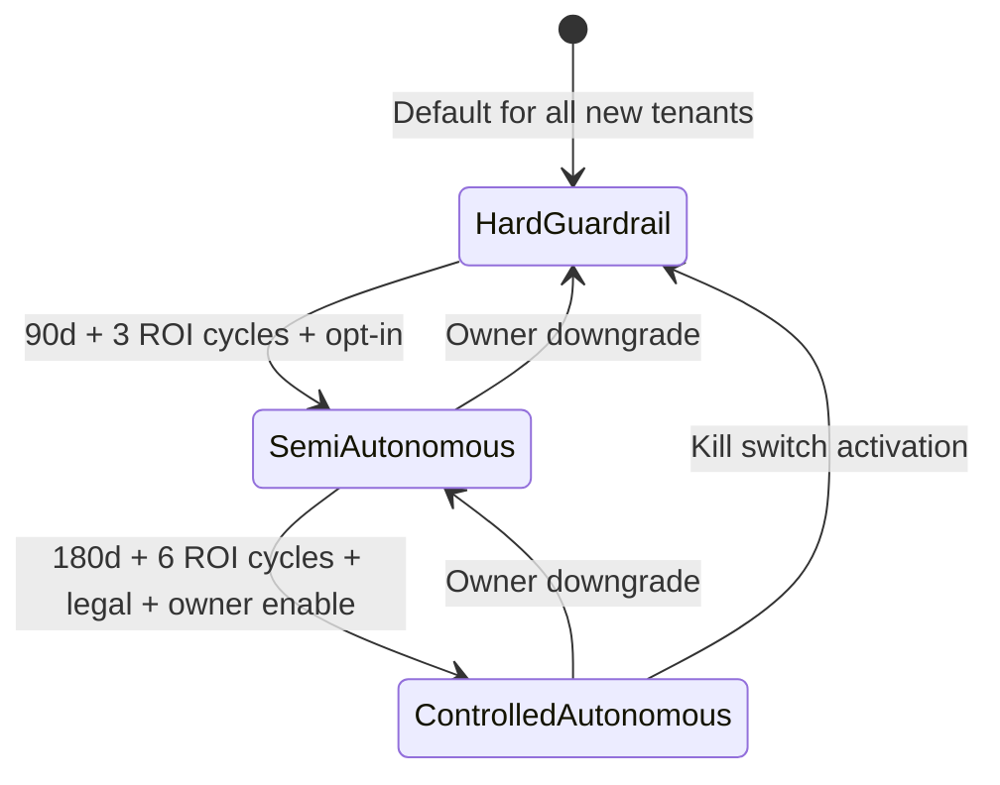
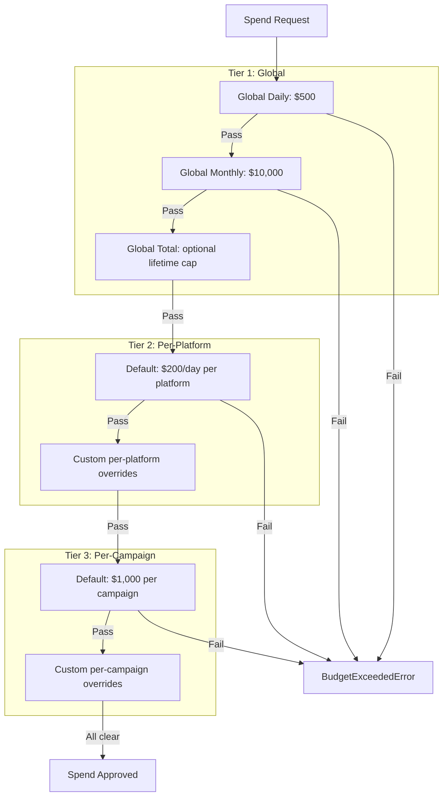

# Guardrailed Bidding & Financial Risk Architecture

**OrchestraAI** — AI-Native Marketing Orchestration Platform

---

## 1. Design Philosophy

The bidding engine operates on four non-negotiable principles:

1. **Compliant** — every action respects platform Terms of Service; hard-coded restrictions (`compliance/restrictions.py`) cannot be overridden by any agent, user, or configuration
2. **Conservative** — the system defaults to the most restrictive settings and earns autonomy through demonstrated performance
3. **Explainable** — every bidding decision is logged with full reasoning, risk score, change percentage, and approval status
4. **Financially bounded** — 3-tier spend caps, anomaly detection, velocity monitoring, and a kill switch ensure no single failure mode can cause unbounded spend

---

## 2. Three-Phase Autonomy Model

Implemented in `src/orchestra/bidding/engine.py` as the `BiddingEngine` class with `AutonomyPhase` state machine.



### Phase 1: Hard Guardrail (Default)

Human approval for everything except safe decreases (≤50%) and pauses. Thresholds: >10% budget change needs approval, >15% bid increase needs approval, $500/day cap, $5,000/campaign cap.

### Phase 2: Semi-Autonomous

Auto-adjust within capped ranges: bids up to 20%, budgets up to 25%, campaign creation up to $10,000. All over-threshold actions flagged for human review. Daily cap: $2,000.

### Phase 3: Controlled Autonomous

Auto-approve everything except extreme outliers (>$20,000 proposed value). Changes within 50% are auto-approved. All thresholds are 2x Semi-Autonomous values. Daily cap: $4,000.

---

## 3. Phase Transition Requirements

Transitions are enforced by `BiddingEngine.transition_phase()` which validates a `TransitionRequirements` model.

### Hard Guardrail → Semi-Autonomous

| Requirement | Threshold | Field |
|-------------|-----------|-------|
| Minimum days active | 90 days | `min_days_active >= 90` |
| Positive ROI cycles | 3 consecutive | `min_positive_roi_cycles >= 3` |
| Anomaly detection validated | Must be operational | `anomaly_detection_validated = True` |
| Customer opt-in | Explicit consent | `customer_opt_in = True` |

### Semi-Autonomous → Controlled Autonomous

| Requirement | Threshold | Field |
|-------------|-----------|-------|
| Minimum days active | 180 days | `min_days_active >= 180` |
| Positive ROI cycles | 6 consecutive | `min_positive_roi_cycles >= 6` |
| Anomaly detection validated | Must be operational | `anomaly_detection_validated = True` |
| Customer opt-in | Explicit consent | `customer_opt_in = True` |
| Legal acknowledgement | Signed agreement | `legal_acknowledgement = True` |
| Owner manual enable | Owner explicitly enables | `owner_manual_enable = True` |

Every transition is recorded as a `PhaseTransitionRecord` with `from_phase`, `to_phase`, `approved_by`, `reason`, and `requirements_met` dict.

---

## 4. Compliance Engine

Five modules in `src/orchestra/compliance/` enforce platform-level compliance.

### 4.1 Per-Platform ToS Rules (`compliance/tos_rules.py`)

Machine-readable ToS constraints for all 9 platforms. Each `PlatformToS` encodes: `max_text_length`, `max_media_count`, `max_hashtags`, `requires_media`, `allows_links`, rate limits (per-endpoint), automation rules (`max_posts_per_day`, `min_interval_seconds`, `allows_automated_engagement`), targeting rules, and prohibited content lists.

Example ranges: Twitter 280 chars / 300 tweets per 15min, Instagram 2,200 chars / 25 publish per day / 30 hashtag max, Google Ads 90 chars / 15,000 API calls per day.

### 4.2 Content Validator (`compliance/content_validator.py`)

Scores content from **0 (safe) to 100 (maximum risk)**.

Validates content length, media count, media requirements, hashtags, link policy, 12 risk keyword patterns ("guaranteed", "get rich", "miracle", etc.), and platform-specific prohibited content. Thresholds: <40 auto-approved, 40–70 flagged for human review, ≥70 auto-rejected.

### 4.3 Rate Limiter (`compliance/rate_limiter.py`)

Maintains a **15% safety buffer** below platform maximums. Example: Twitter 300 tweets/15min → effective limit 255. Tracks per-platform, per-endpoint usage in sliding windows. `acquire()` returns `False` when throttled.

### 4.4 Policy Monitor (`compliance/policy_monitor.py`)

Tracks platform API changelog feeds for all 9 platforms and auto-disables features when critical policy changes are detected. Change types: `deprecation`, `new_restriction`, `limit_change`, `tos_update`. Critical changes auto-disable affected features until manual team review and re-enable.

### 4.5 Restrictions (`compliance/restrictions.py`)

**14 hard-coded absolute restrictions** that no agent, user, or configuration can override:

| ID | Category | Description |
|----|----------|-------------|
| `NO_RATE_LIMIT_BYPASS` | platform_integrity | Never bypass platform rate limits |
| `NO_HUMAN_IMPERSONATION` | platform_integrity | Never mask automation as human behavior |
| `NO_PROHIBITED_AD_CATEGORIES` | content_safety | Never automate prohibited ad categories |
| `NO_PLATFORM_GAMING` | platform_integrity | Never use fake engagement or click farms |
| `NO_DECEPTIVE_PRACTICES` | content_safety | Never create misleading content |
| `NO_MINOR_TARGETING` | targeting_safety | Never target users under 18 without compliance |
| `NO_CREDENTIAL_SHARING` | security | Never expose credentials in plaintext |
| `NO_UNAUTHORIZED_DATA_USE` | privacy | Never use data without consent |

Plus 6 more restrictions covering review circumvention, loophole exploitation, policy violations, prohibited targeting, data scraping, and unofficial endpoints. `check_restriction(action)` raises `RestrictedActionError` on violation.

---

## 5. Financial Risk Containment

Four modules in `src/orchestra/risk/` form a defense-in-depth financial protection system.

### 5.1 Three-Tier Spend Caps (`risk/spend_caps.py`)



The `SpendTracker` class checks all three tiers via `check_spend()` and returns a list of violations. `record_spend()` raises `BudgetExceededError` if any cap is violated.

**Default caps** (`SpendCaps` model):

| Cap | Default | Configurable |
|-----|---------|:------------:|
| `global_daily_cap` | $500.00 | Yes |
| `global_monthly_cap` | $10,000.00 | Yes |
| `global_total_cap` | None (unlimited) | Yes |
| `default_platform_daily_cap` | $200.00 | Yes |
| `default_campaign_cap` | $1,000.00 | Yes |
| `new_account_daily_cap` | $100.00 | Yes |
| `new_account_max_exposure` | $500.00 | Yes |

### 5.2 Anomaly Detection (`risk/anomaly.py`)

The `AnomalyDetector` uses two statistical methods:

**Z-Score Detection:**
```
z = (value - mean) / std_dev
Anomaly if |z| > 2.5
```

**IQR (Interquartile Range) Detection:**
```
IQR = Q3 - Q1
Lower bound = Q1 - 1.5 × IQR
Upper bound = Q3 + 1.5 × IQR
Anomaly if value < lower or value > upper
```

Both methods run on a rolling window of 30 data points (`DEFAULT_WINDOW_SIZE`). Anomalies are checked both globally and per-platform. When `auto_raise=True`, raises `AnomalyDetectedError` immediately.

### 5.3 Velocity Monitoring (`risk/velocity.py`)

The `SpendVelocityMonitor` tracks the rate of spend ($/hour) and flags sudden spikes.

| Parameter | Default | Description |
|-----------|---------|-------------|
| `window_seconds` | 3,600 (1 hour) | Sliding window for velocity calculation |
| `spike_multiplier` | 3.0 | Spike threshold: current velocity > 3× baseline |
| `_hourly_history` | 168 slots (7 days) | Moving average for baseline computation |

**Spike detection logic:**
```
current_velocity = total_spend_in_window / hours
is_spike = current_velocity > baseline_velocity × 3.0
```

Baseline is updated from the 7-day rolling hourly average via `update_baseline()`.

### 5.4 Alert Manager (`risk/alerts.py`)

Budget alerts fire at configurable thresholds. Each alert has an `AlertSeverity` and `AlertType`.

| Threshold | Type | Severity | Alert |
|-----------|------|----------|-------|
| 50% utilization | `budget_50pct` | INFO | Informational log |
| 75% utilization | `budget_75pct` | WARNING | Warning notification |
| 90% utilization | `budget_90pct` | CRITICAL | Critical alert |
| 100% utilization | `budget_100pct` | EMERGENCY | Emergency — kill switch evaluation |

Additional alert types: `anomaly_detected`, `velocity_spike`, `kill_switch_activated`, `approval_needed`, `policy_change`.

Alerts support acknowledgement via `acknowledge(alert_id, acknowledged_by)`. Unacknowledged alerts are tracked per-tenant. Threshold state resets at daily boundary via `reset_thresholds()`.

---

## 6. Kill Switch

Implemented in `BiddingEngine.activate_kill_switch()` and persisted in `kill_switch_events` table (`db/models.py`).

### Activation

```python
engine.activate_kill_switch(
    activated_by="system:anomaly_detector",
    reason="Spend velocity 5.2x baseline detected"
)
```

When active, `_kill_switch_active = True` causes `evaluate_action()` to raise `BudgetExceededError` for every action — no spend operations can proceed.

### Properties

| Property | Value |
|----------|-------|
| **Scope** | Global (all platforms, all campaigns for the tenant) |
| **Activation** | Manual (owner) or automatic (anomaly/velocity triggers) |
| **Deactivation** | Manual only — requires explicit `deactivate_kill_switch()` call |
| **Persistence** | Events logged to `kill_switch_events` table with `tenant_id`, `action`, `triggered_by`, `reason`, `affected_platforms`, `affected_campaigns` |
| **Required role** | `kill_switch:activate` permission (owner only via RBAC) |

Events are persisted to the `kill_switch_events` table with `tenant_id`, `action`, `triggered_by`, `reason`, `affected_platforms`, and `affected_campaigns`.

---

## 7. Decision Audit Trail

Every bidding decision is captured as a `BiddingDecision` model with: `id`, `tenant_id`, `action` (BiddingAction enum), `platform`, `campaign_id`, `current_value`, `proposed_value`, `change_pct`, `requires_approval`, `approved`, `approved_by`, `reasoning`, `risk_score` (0–10), and `timestamp`.

Risk scores are computed by `_compute_risk()`: budget increases/bid adjustments contribute `min(change_pct / 10, 5.0)`, high proposed values add `min(proposed_value / 5000, 3.0)`, and campaign creation adds +2.0 flat. Maximum score is 10.0.

---

## 8. Risk Mitigation Matrix

| Risk | L/I | Mitigation | Module |
|------|:---:|------------|--------|
| **ToS Violation** | M/H | Per-platform rules, content validator, 15% rate buffer, 14 restrictions | `compliance/` |
| **Budget Overspend** | M/H | 3-tier caps, anomaly detection, velocity monitoring, kill switch | `risk/`, `bidding/engine.py` |
| **Policy Drift** | M/M | Policy monitor with auto-disable, changelog tracking | `compliance/policy_monitor.py` |
| **API Dependency** | L/M | Retry (3 attempts, 2–30s), 429 detection, LLM fallback chain | `platforms/*.py` |
| **Algorithm Underperformance** | M/M | Hard Guardrail default, 90-day maturity, ROI cycle requirements | `bidding/engine.py` |
| **Anomalous Spend** | M/H | Z-score + IQR detection, 3x velocity spike, 50/75/90% alerts | `risk/` |
| **Kill Switch Failure** | L/C | Synchronous check on every `evaluate_action()`, no race condition | `bidding/engine.py` |

---

## 9. Configuration Reference

### BiddingEngine Thresholds

| Phase | `budget_change_pct` | `bid_increase_pct` | `max_daily_spend` | `max_campaign_budget` |
|-------|:-------------------:|:------------------:|:-----------------:|:--------------------:|
| Hard Guardrail | 10% | 15% | $500 | $5,000 |
| Semi-Autonomous | 25% | 20% | $2,000 | $10,000 |
| Controlled Autonomous | 50% | 40% | $4,000 | $20,000 |

### Risk Detection Parameters

| Parameter | Default | Location |
|-----------|---------|----------|
| `z_threshold` | 2.5 | `risk/anomaly.py` |
| `iqr_multiplier` | 1.5 | `risk/anomaly.py` |
| `window_size` | 30 data points | `risk/anomaly.py` |
| `spike_multiplier` | 3.0× baseline | `risk/velocity.py` |
| `velocity_window` | 3,600s (1 hour) | `risk/velocity.py` |
| `buffer_pct` | 0.15 (15%) | `compliance/rate_limiter.py` |
| `human_review_threshold` | 40 (content score) | `compliance/content_validator.py` |
| `auto_reject_threshold` | 70 (content score) | `compliance/content_validator.py` |

### Alert Thresholds

| Level | Utilization | `AlertSeverity` |
|-------|:-----------:|:---------------:|
| Info | 50% | `INFO` |
| Warning | 75% | `WARNING` |
| Critical | 90% | `CRITICAL` |
| Emergency | 100% | `EMERGENCY` |
