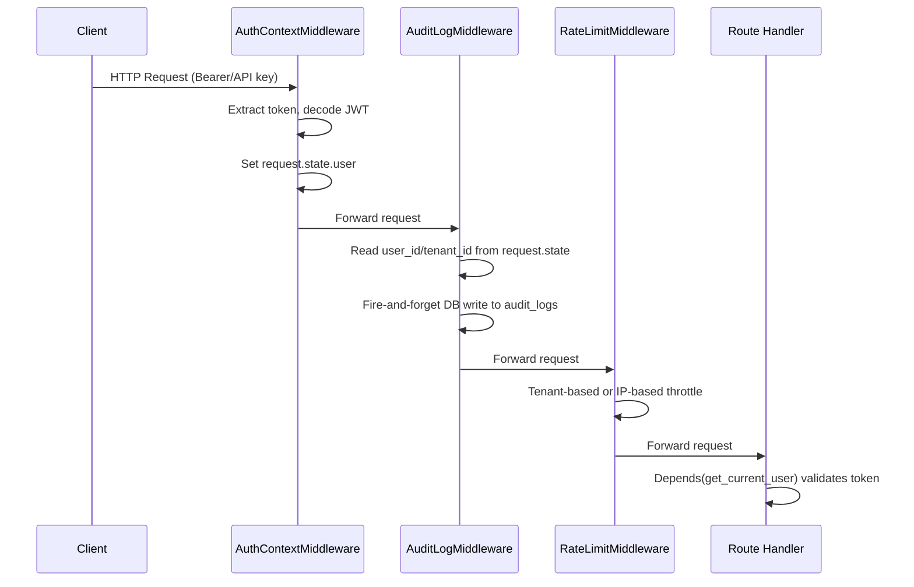
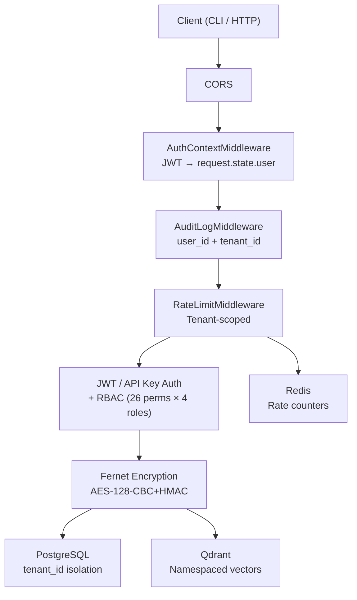

# Security & Compliance Architecture

**OrchestraAI** — AI-Native Marketing Orchestration Platform

---

## 1. Authentication Pipeline

OrchestraAI implements a **dual-auth** system supporting both JWT bearer tokens and hashed API keys. The authentication pipeline is implemented as a layered middleware chain in `src/orchestra/main.py`, ordered so that each layer can rely on data set by the previous one.

### Middleware Execution Order

```
CORS → AuthContextMiddleware → AuditLogMiddleware → RateLimitMiddleware → Route Handler
```

Starlette middleware is added in reverse order (last added = first executed), so the registration in `main.py` is:

```python
app.add_middleware(RateLimitMiddleware, ...)
app.add_middleware(AuditLogMiddleware)
app.add_middleware(AuthContextMiddleware)
app.add_middleware(CORSMiddleware, ...)
```

### AuthContextMiddleware (`api/middleware/auth_context.py`)

Runs first after CORS. Extracts the JWT from the `Authorization: Bearer <token>` header or the `X-API-Key` header. On successful decode via `jose.jwt.decode()`, sets `request.state.user` to a `TokenPayload` containing `sub` (user_id), `tenant_id`, `role`, and `exp`. Never rejects requests — unauthenticated traffic passes through with `request.state.user` unset.

### AuditLogMiddleware (`api/middleware/audit.py`)

Reads `request.state.user` (set by `AuthContextMiddleware`) to populate `user_id` and `tenant_id` on every audit log entry. Performs **fire-and-forget** async DB writes to the `audit_logs` table via `_persist_audit_entry()`. Errors are caught and logged at debug level — audit failures never break the request path.

### RateLimitMiddleware (`api/middleware/rate_limit.py`)

Uses `tenant_id` from `request.state.user` for tenant-scoped rate limiting when the request is authenticated. Falls back to IP-based rate limiting for unauthenticated requests. Configurable via `settings.rate_limit_per_minute`.

### Route-Level Auth: `get_current_user` (`api/middleware/auth.py`)

Protected endpoints use `Depends(get_current_user)` which provides a `TokenPayload`. Supports two paths:

1. **Bearer JWT** — decoded via `decode_access_token()` using HMAC-SHA256 (`python-jose`).
2. **API Key** — looked up in the `api_keys` table via `_resolve_api_key()` (SHA-256 hash comparison). Falls back to JWT decode for backwards compatibility with JWT-formatted API keys.



---

## 2. OAuth2 Platform Flows

Each of the 9 platform connectors (`src/orchestra/platforms/`) implements OAuth2 with platform-specific nuances.

| Platform | OAuth Variant | Token Lifecycle | Implementation File |
|----------|--------------|-----------------|---------------------|
| **Twitter** | OAuth 2.0 PKCE (code_challenge + code_verifier) | Short-lived access + refresh | `platforms/twitter.py` |
| **YouTube** | Google OAuth 2.0 (authorization_code) | Access (1hr) + refresh | `platforms/youtube.py` |
| **Facebook** | OAuth 2.0 → long-lived token exchange | Short-lived → 60-day exchange | `platforms/facebook.py` |
| **Instagram** | OAuth 2.0 via Meta (same as Facebook) | Long-lived token via Meta exchange | `platforms/instagram.py` |
| **LinkedIn** | OAuth 2.0 3-legged (authorization_code) | Access (60 days) + refresh | `platforms/linkedin.py` |
| **TikTok** | OAuth 2.0 (authorization_code) | Access + refresh | `platforms/tiktok.py` |
| **Pinterest** | OAuth 2.0 + Basic Auth for token exchange | Access + refresh | `platforms/pinterest.py` |
| **Snapchat** | OAuth 2.0 (authorization_code) | Access + refresh | `platforms/snapchat.py` |
| **Google Ads** | Google OAuth 2.0 (same provider as YouTube) | Access (1hr) + refresh | `platforms/google_ads.py` |

All connectors share: retry with exponential backoff (tenacity, 3 attempts, 2–30s), 429 rate-limit detection with `Retry-After` header parsing, and content validation against per-platform limits.

---

## 3. Token Encryption

### Algorithm: Fernet (AES-128-CBC + HMAC-SHA256)

OAuth access tokens and refresh tokens are encrypted at rest using the `cryptography.fernet.Fernet` cipher (`src/orchestra/security/encryption.py`). Fernet provides:

- **AES-128-CBC** for confidentiality
- **HMAC-SHA256** for integrity / tamper detection
- **Timestamp-based** token versioning

### Encrypted Fields in `PlatformConnection` (`db/models.py`)

| Column | Type | Description |
|--------|------|-------------|
| `access_token_encrypted` | `Text` | Fernet-encrypted OAuth access token |
| `refresh_token_encrypted` | `Text` | Fernet-encrypted OAuth refresh token (nullable) |

### Key Management

The Fernet key is loaded from `settings.fernet_key` (Pydantic `SecretStr`). A safety check in `_get_fernet()` detects default/placeholder keys starting with `"CHANGE-ME"` and generates a runtime key — but this means tokens encrypted before a restart are unrecoverable if the config uses the default. Production deployments must set a stable `FERNET_KEY` in `.env`.

```python
# src/orchestra/security/encryption.py
def encrypt_token(plaintext: str) -> str:
    f = _get_fernet()
    return f.encrypt(plaintext.encode()).decode()

def decrypt_token(ciphertext: str) -> str:
    f = _get_fernet()
    return f.decrypt(ciphertext.encode()).decode()
```

### Encryption Coverage

Currently only OAuth tokens in `security/oauth.py` are encrypted. Database fields for user data, campaign content, and audit entries are not encrypted at rest (rely on PostgreSQL-level TDE or disk encryption).

---

## 4. Role-Based Access Control (RBAC)

Defined in `src/orchestra/security/rbac.py`. Four roles with hierarchical permission inheritance:

```
viewer → member → admin → owner
```

### Role → Permission Matrix

| Permission | Viewer | Member | Admin | Owner |
|-----------|--------|--------|-------|-------|
| `campaign:view` | Y | Y | Y | Y |
| `campaign:create` | | Y | Y | Y |
| `campaign:edit` | | Y | Y | Y |
| `campaign:delete` | | | Y | Y |
| `campaign:publish` | | Y | Y | Y |
| `platform:connect` | | Y | Y | Y |
| `platform:disconnect` | | | Y | Y |
| `analytics:view` | Y | Y | Y | Y |
| `analytics:export` | | Y | Y | Y |
| `budget:view` | Y | Y | Y | Y |
| `budget:edit` | | | Y | Y |
| `budget:approve` | | | Y | Y |
| `user:invite` | | | Y | Y |
| `user:remove` | | | | Y |
| `user:change_role` | | | | Y |
| `kill_switch:activate` | | | | Y |
| `data:export` | | | Y | Y |
| `data:delete` | | | | Y |
| `orchestrator:run` | | Y | Y | Y |
| `audit:view` | | | Y | Y |

Role is encoded in the JWT `role` claim. Route-level enforcement uses the `require_role()` dependency factory:

```python
# Protect an endpoint for admin+ only
@router.get("/admin-only", dependencies=[Depends(require_role("admin", "owner"))])
```

Programmatic checks use `check_permission(role, Permission.BUDGET_APPROVE)` which raises `AuthorizationError` on failure.

---

## 5. Audit Trail

Implemented in `src/orchestra/security/audit_trail.py`. Two entry types:

- **`AuditEntry`** — general operations (logins, campaign edits, config changes)
- **`FinancialAuditEntry`** — extends `AuditEntry` with `platform`, `amount`, `currency`, `previous_value`, `new_value`, `budget_utilization_pct`

### Persistence Strategy

1. In-memory `list[AuditEntry]` for fast synchronous reads
2. Fire-and-forget `asyncio.create_task()` to persist to `audit_logs` table
3. `query_db()` reads from PostgreSQL with fallback to in-memory cache

### DB Schema (`audit_logs`)

Key indexes: `ix_audit_tenant_action` (tenant_id, action), `ix_audit_created` (created_at). Fields include `tenant_id`, `user_id`, `action`, `resource_type`, `resource_id`, `details` (JSONB), `ip_address`, `user_agent`.

---

## 6. GDPR Handling

Implemented in `src/orchestra/security/gdpr.py`. Exposed via API routes at `/api/v1/gdpr/`.

### Supported Operations

| Operation | GDPR Article | Endpoint |
|-----------|-------------|----------|
| Data Export | Article 20 (Portability) | `POST /api/v1/gdpr/export` |
| Data Deletion | Article 17 (Right to Erasure) | `POST /api/v1/gdpr/deletion` |
| Consent Recording | Article 7 (Consent) | `POST /api/v1/gdpr/consent` |
| Consent Status | Article 7 | `GET /api/v1/gdpr/consent/status` |

### Data Categories Subject to Export/Deletion

`users`, `campaigns`, `posts`, `analytics`, `platform_connections`, `audit_logs`, `consent_records`, `agent_decisions`, `spend_records`, `oauth_tokens`, `agent_memory`, `performance_embeddings`, `tenant_model`.

### Current Implementation Status

The `GDPRManager` tracks requests in-memory (singleton at `_gdpr_manager`). Data deletion currently cleans Qdrant vectors via `rag/indexer.delete_tenant_data()`. Consent records support grant, revocation, and per-type status queries across four consent types: `data_processing`, `marketing`, `analytics`, `third_party`.

---

## 7. SOC 2 Readiness Roadmap

### Implemented Controls

| SOC 2 Criteria | Status | Evidence |
|----------------|--------|----------|
| **CC6.1** Logical access controls | Implemented | JWT + API key auth, RBAC with 4 roles, `require_role()` |
| **CC6.2** User authentication | Implemented | bcrypt password hashing, JWT with expiration, `TokenPayload` |
| **CC6.3** Authorization enforcement | Implemented | 26 granular permissions in `security/rbac.py` |
| **CC7.2** System monitoring | Partial | Audit trail with fire-and-forget DB writes, structlog |
| **CC8.1** Change management | Partial | Git-based, CI/CD workflows, but no formal approval process |
| **CC6.7** Encryption of data in transit | Planned | TLS termination at load balancer (not in app layer) |
| **CC6.8** Encryption of data at rest | Partial | Fernet for OAuth tokens only |

### Gaps Requiring Attention

- Database-level encryption at rest (PostgreSQL TDE or application-layer for PII)
- Formal incident response procedures
- Third-party penetration testing
- Periodic access reviews (automated role audit)
- Data retention policies with automated purge

---

## 8. Multi-Tenant Isolation

### Database-Level Isolation

Every core table includes a `tenant_id` column with a foreign key to `tenants.id`:

| Table | `tenant_id` Type | Enforced |
|-------|-----------------|----------|
| `users` | `UUID FK` | Yes — indexed, non-nullable |
| `campaigns` | `UUID FK` | Yes — composite index with `status` |
| `platform_connections` | `UUID FK` | Yes — unique per (tenant, platform) |
| `audit_logs` | `UUID FK` | Nullable (public endpoints) |
| `spend_records` | `UUID FK` | Yes — composite index with `created_at` |
| `api_keys` | `UUID FK` | Yes — indexed |
| `kill_switch_events` | `String(255)` | Indexed but not a FK |

### Query-Level Enforcement

Route handlers receive `tenant_id` from the authenticated `TokenPayload` and scope all queries:

```python
stmt = select(Campaign).where(Campaign.tenant_id == current_user.tenant_id)
```

### Middleware-Level Enforcement

- `AuthContextMiddleware` sets `request.state.user.tenant_id`
- `AuditLogMiddleware` tags every log entry with the authenticated tenant
- `RateLimitMiddleware` uses tenant-scoped rate limit keys

### Cross-Tenant Data Leakage Prevention

- No admin "superuser" endpoints that bypass tenant scoping
- `CampaignPost` isolation traverses through `Campaign.tenant_id`
- Qdrant vector collections are namespaced by tenant
- GDPR deletion is scoped to a single tenant's data

---

## 9. Security Architecture Diagram


