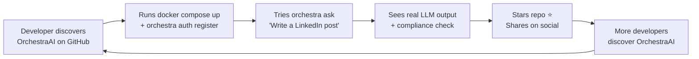

# OrchestraAI Viral & Growth Strategy

## GitHub Optimization Package

### README Structure

The project README (`README.md`) follows a proven structure for open-source developer tools:

1. **Hero section**: Project name, one-line value proposition, badge row
2. **Feature matrix**: Checkmarks for each subsystem (9 platform connectors, LangGraph orchestrator, RAG, bidding engine, etc.)
3. **Quick start**: `docker compose up -d && pip install orchestraai && orchestra auth register`
4. **Architecture diagram**: Mermaid graph showing the full system
5. **CLI demo**: GIF or code block showing `orchestra ask "Write a LinkedIn post about Q1 results"`
6. **License**: Apache 2.0

### Badge Strategy

| Badge | Purpose | Source |
|-------|---------|--------|
| `CI/CD: passing` | Build credibility | GitHub Actions (`ci.yml`) |
| `Tests: 273 passing` | Quality signal | `pytest` with `pytest-cov` |
| `Python 3.12+` | Compatibility | `pyproject.toml` target |
| `License: Apache 2.0` | Commercial friendliness | `LICENSE` file |
| `Code style: Ruff` | Code quality | `pyproject.toml` Ruff config |
| `Docker: ready` | Deployment ease | `docker-compose.yml` |

### Star Mechanics

GitHub star growth follows a power-law distribution driven by:

- **Initial surge**: First 100 stars from direct network (colleagues, Twitter/X followers, communities)
- **Discovery phase**: GitHub Trending page threshold (~30 stars/day sustained for 2-3 days)
- **Compound growth**: Each star increases visibility → more stars. "Awesome" lists and aggregators pick up trending repos
- **Sustain**: Consistent release cadence (weekly) and active issue triage maintain momentum

Target milestones: 100 stars (week 1) → 500 stars (month 1) → 2,000 stars (month 3) → 5,000 stars (month 6).

---

## Developer-First Growth Loop

OrchestraAI's growth flywheel is designed around developer experience:



### The CLI as the Growth Engine

The Typer+Rich CLI (`src/orchestra/cli/app.py`) is the primary acquisition surface. Key commands that drive engagement:

| Command | Experience | Shareability |
|---------|-----------|-------------|
| `orchestra ask "..."` | Natural language → AI-generated content + compliance check | Screenshot-worthy Rich output |
| `orchestra campaign create` | Interactive prompts with Rich formatting | Shows depth of the platform |
| `orchestra status` | Infrastructure health table (API/PostgreSQL/Redis/Ollama) | Demonstrates production-grade |
| `orchestra analytics` | Cross-platform metrics with per-platform breakdown | Data-rich Rich tables |

Each command produces visually appealing terminal output via Rich panels and tables -- optimized for developer screenshots and tweets.

### Blog Post Pipeline

Content topics grounded in actual codebase features:

1. **"Building a LangGraph Multi-Agent System for Marketing"** -- Walk through the 8-node orchestrator graph, conditional routing, and safety module
2. **"9 Platform APIs in One Codebase: Lessons from OAuth Hell"** -- Real OAuth2 flows for Twitter PKCE, Meta long-lived tokens, Google OAuth refresh
3. **"3-Phase Guardrailed Bidding: How We Keep AI from Spending Your Money"** -- BiddingEngine autonomy phases, kill switch, spend caps
4. **"Cross-Platform Engagement Normalization"** -- The signal weighting system (`PLATFORM_SIGNAL_WEIGHTS`) and why a LinkedIn share ≠ a TikTok like
5. **"Differential Privacy in Marketing Analytics"** -- How the global model uses Laplace noise (ε=1) to protect tenant data
6. **"Cost-Aware LLM Routing"** -- SIMPLE/MODERATE/COMPLEX tiers, local Ollama fallback, video pipeline economics

---

## Content Marketing Flywheel

### Phase 1: Technical Credibility (Months 1-2)

- Publish 2 deep-dive blog posts per week on the topics above
- Each post includes runnable code snippets referencing real file paths
- Cross-post to dev.to, Hashnode, and Medium
- Submit to Hacker News with concise "Show HN" titles

### Phase 2: Community Content (Months 2-4)

- Publish "How OrchestraAI Compares to..." articles for Hootsuite, Buffer, HubSpot
- Release video walkthroughs of the CLI and orchestrator
- Create a "Build a Marketing Bot in 30 Minutes" tutorial using the orchestrator endpoint
- Contributor spotlight posts for PRs merged

### Phase 3: User-Generated (Months 4-6)

- Feature community integrations and plugins
- Showcase campaigns run through OrchestraAI with real metrics
- Publish quarterly "State of the Union" transparency reports (like `STATE_OF_THE_UNION.md`)

---

## Technical Community Engagement

### Hacker News

**Target**: 2-3 front-page appearances in first 3 months.

- **Show HN posts**: "Show HN: Open-source AI marketing platform with 9 platform connectors and guardrailed bidding"
- **Timing**: Tuesday-Thursday, 9-11am ET
- **Comment strategy**: Author responds to every question with specific code references and architecture decisions

### Reddit

| Subreddit | Content Type | Frequency |
|-----------|-------------|-----------|
| r/Python | Technical deep-dives (LangGraph, FastAPI patterns) | Biweekly |
| r/MachineLearning | Data moat, differential privacy, embedding pipeline | Monthly |
| r/SideProject | Launch announcement with architecture overview | Once |
| r/selfhosted | Docker Compose deployment guide + Ollama local inference | Once |
| r/marketing | "Open-source alternative to [paid tool]" positioning | Monthly |
| r/artificial | LangGraph agent design, cost-aware routing | Monthly |

### Dev Communities

- **Discord**: Create OrchestraAI server with #help, #showcase, #development channels
- **X/Twitter**: Thread-based launch narrative, CLI GIF demos, architecture diagrams
- **LinkedIn**: B2B positioning for marketing teams, case study format

---

## Open-Source Positioning

### License: Apache 2.0

Apache 2.0 was chosen for maximum adoption:

- **Enterprise-friendly**: Patent grant clause reassures legal teams
- **Fork-friendly**: Allows proprietary modifications (drives adoption, not competition)
- **Ecosystem-compatible**: Compatible with MIT, BSD, and other permissive licenses

### Open-Core Model

| Layer | License | Contents |
|-------|---------|----------|
| **Core** (open) | Apache 2.0 | All 9 connectors, LangGraph orchestrator, RAG, bidding engine, CLI, risk controls |
| **Enterprise** (commercial) | Proprietary | SSO/SAML, audit log export, SLA-backed support, custom connectors, white-label |
| **Cloud** (SaaS) | Subscription | Managed hosting, auto-scaling, premium LLM access, dedicated Qdrant cluster |

### Contribution Strategy

- `CONTRIBUTING.md` with clear setup instructions, code style (Ruff), and PR process
- Issue templates for bug reports and feature requests (YAML format in `.github/`)
- "Good first issue" labels for onboarding new contributors
- CI pipeline validates all PRs: Ruff linting, `pytest` suite (273 tests), type checking (`mypy --strict`)

---

## Growth Metrics Framework

### North Star Metric

**Weekly Active CLI Users (WACU)**: Unique users executing `orchestra` commands against the API per week.

### Funnel Metrics

| Stage | Metric | Target (Month 3) |
|-------|--------|-------------------|
| **Awareness** | GitHub page views | 10,000/month |
| **Interest** | README read-through rate | >40% |
| **Activation** | `docker compose up` completions | 500/month |
| **Engagement** | `orchestra ask` executions | 200/week |
| **Retention** | Users returning after 7 days | >30% |
| **Revenue** | Enterprise plan inquiries | 10/month |

### GitHub Metrics

| Metric | Month 1 | Month 3 | Month 6 |
|--------|---------|---------|---------|
| Stars | 500 | 2,000 | 5,000 |
| Forks | 50 | 200 | 600 |
| Contributors | 5 | 15 | 40 |
| Open issues | 20 | 50 | 80 |
| Monthly clones | 300 | 1,500 | 5,000 |

---

## Viral Coefficient Analysis

### Model

```
K = (invites per user) × (conversion rate)
```

For developer tools, the viral loop is:

1. Developer uses OrchestraAI → shares on X/Reddit/Discord → 5-10 impressions per share
2. Of those impressions, ~10% click through to GitHub
3. Of those visitors, ~5% star the repo
4. Of those who star, ~20% install locally
5. Of those who install, ~30% share their experience

**Estimated K-factor: 0.15-0.25** (each user brings 0.15-0.25 new users organically)

This is below viral threshold (K=1), which is typical for developer tools. Growth is sustained through:

- **Content multiplication**: Each blog post has a ~2-month SEO tail
- **Network effects**: More contributors → more features → more users
- **Platform lock-in**: Once campaigns are running through OrchestraAI, switching cost increases
- **Data moat**: The more campaigns a tenant runs, the better their predictions become (the `FlywheelPipeline` in `src/orchestra/moat/flywheel.py`)

### Acceleration Tactics

| Tactic | Expected Impact | Effort |
|--------|----------------|--------|
| "Awesome" list inclusion (awesome-python, awesome-fastapi) | +200 stars/week for 2 weeks | Low |
| Show HN front page | +500-2,000 stars in 48 hours | Medium |
| Conference talk (PyCon, AI Engineer Summit) | +300 stars + enterprise leads | High |
| Integration with popular tools (n8n, Langflow) | Ongoing discovery channel | Medium |
| YouTube tutorial by popular creator | +500-1,000 stars, sustained traffic | Medium |
